# PlatziVideo

## Tabla de contenido 

[Inicio del proyecto](#Inicio-del-proyecto)

[Cómo llega un script al navegador](#Cómo-llega-un-script-al-navegador)

[Scope](#Scope)

[Closures](#Closures)

[El primer plugin](#El-primer-plugin)

[this](#this)

[]()

[]()

[]()

[]()

[]()

[]()

[]()

[]()

[]()

[]()

[]()

[]()

[]()

[]()

[]()

[]()

[]()

[]()

[]()

[]()

[]()

[]()

## Inicio del proyecto

Trabajaremos en el proyecto PlatziVideo, una plataforma de vídeo.

Esta es la base de nuestro proyecto y nos vamos a enfocar en el MediaPlayer. Durante el curso se desarrollarán plugins de forma modular para extender la funcionalidad del MediaPlayer.

El repositorio de este curso lo encuentras en: https://github.com/platzi/javascript-profesional

**Nota:** El repositorio esta completo, para iniciarlo desde el principio lo primero que hay que hacer es clonarlo y luego ir al commit en el que empieza todo con el siguiente comando en la terminal

`git reset ff1badc05e00be6bb018bf3e5705ba672e20821f --hard`

___

Para empezar lo primero que hay que hacer es abrir la terminal y en la ubicacion del proyecto escribir lo siguiente

`npm init -y`

Al ejecutar esto en la terminal lo que hace es crear una carpeta llamada **package.json** con informacion pero si se quiere se puede cambiar por la siguiente aclarado, que el `author` y `description` debe ser el de la persona que lo realice

{
  "name": "Curso-javascript-profesional",
  "version": "1.0.0",
  "description": "PlatziVideo",
  "license": "MIT",
  "author": "Jeyfred Calderon <jeyfredc@gmail.com>",
  "keywords": [
    "platzi"
  ],
  "scripts": {},
  "devDependencies": {}
}

A continuacion en la terminal hacer la instalacion de live-server con el siguiente comando

`npm i -D live-server`

la `i` es de `install`, la bandera D `-D` quiere decir que este proyecto es solo para desarrollo y no se va a utilizar para produccion y `live-server` es la herramienta que ayudara a cargar el archivo **index.html** en el navegador

Al realizar la instalacion lo que va a hacer es que en el archivo **package.json** en la parte de `devDependencies` se encuentre instalada live-server y para poder usarla en los `scripts` se va a dejar un comando para inicializar live-server

```
{
  "name": "Curso-javascript-profesional",
  "version": "1.0.0",
  "description": "PlatziVideo",
  "license": "MIT",
  "author": "Jeyfred Calderon <jeyfredc@gmail.com>",
  "keywords": [
    "platzi"
  ],
  "scripts": {
    "start": "live-server"
  },
  "devDependencies": {
    "live-server": "^1.2.1"
  }
}
```

para usarlo en la terminal ejecutar el siguiente comando 

`npm start `

Automaticamente se va a abrir el archivo **index.html** en el navegador

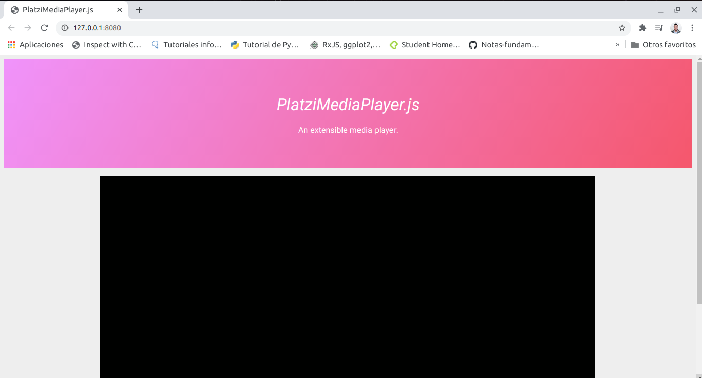

la ruta que aparece es **127.0.0.1:8080** es lo mismo que escribir **localhost:8080**

En el archivo **index.html** añadir las etiquetas de script para empezar a ejecutar y compilar el codigo de bajo de la etiqueta que cierra main `</main>`

```
<html>
  <head>
    <title>PlatziMediaPlayer.js</title>
    <link
      rel="stylesheet"
      href="https://necolas.github.io/normalize.css/8.0.1/normalize.css"
    />
    <link rel="stylesheet" href="./assets/index.css" />
  </head>

  <body>
    <header>
      <h1>PlatziMediaPlayer.js</h1>
      <p>An extensible media player.</p>
    </header>

    <main class="container">
      <video class="movie">
        <source src="./assets/BigBuckBunny.mp4" />
      </video>

      <button>Play/Pause</button>
    </main>

    <script>

    </script>
  </body>
</html>

```

En la carpeta **assets** del proyecto existe un video llamado **BigBuckBunny.mp4** para poder traerlo al documento se hace lo siguiente dentro de las etiquetas scripts

1. Se crea una constante video y se llama a la etiqueta `<video>` del html para poder hacer uso de ella, por el momento es la unica etiqueta que existe en el html a traves de un `querySelector` que representa un elemento o varios

2. Se crea una constante button y se llama a la etiqueta `<button>` del html para poder hacer uso de ella, por el momento es la unica etiqueta que existe en el html

3. Como el boton ya esta a la escucha de una instruccionse indica que por medio de un click el video haga play. El atributo `video.play` se utiliza sabiendo que todos los elementos del DOM(Document Object Model) tienen un API(Application programming interface). Si se quiere saber cuales son los atributos de video se puede buscar en [mdn htmlmediaelement](https://developer.mozilla.org/es/docs/Web/API/HTMLMediaElement)

```
      const video = document.querySelector("video")
      const button = document.querySelector("button")

      button.onclick = () => video.play();
```

Si se comentara la linea `//button.onclick = () => video.play();` y luego se colocara `video.play();` lo que va a pasar es que la consola del navegador va a mostrar el error **(index):31 Uncaught (in promise) DOMException**

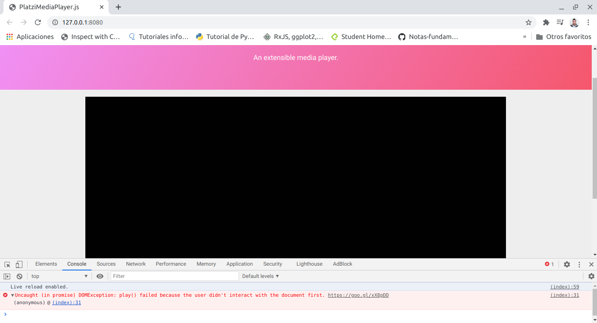

Este error se muestra para evitar que en los navegadores el video se empiece a reproducir solo

Descomentando la linea, el usuario puede dar click en el boton play en el navegador pero hay que buscar que se haga mas extensible el codigo para esto se crea una clase y el codigo queda de la siguiente forma

1. Se crea la clase MediaPlayer

2. Se crea el constructor con el parametro config y utilizando `media` se llama a la funcion play en el metodo `play(){}`

3. Se instancia la clase MediaPLayer a traves de la constante player pasando como parametro al elemento video

4. por medio de la funcion `button.onclick()` se manda a llamar al metodo `play()`

```
    <script>
      const video = document.querySelector("video")
      const button = document.querySelector("button")

      class MediaPlayer {
        constructor(config){
          this.media = config.movie
        }
        play(){
          this.media.play()
        }

      }

      const player = new MediaPlayer({ movie: video})

      button.onclick = () => player.play();


    </script>
```

**Nota:** Queda como reto añadir la funcionalidad para que el video haga pausa, es importante apoyarse de la documentacion que existe [mdn htmlmediaelement](https://developer.mozilla.org/es/docs/Web/API/HTMLMediaElement)

## Cómo llega un script al navegador

El **DOM** es la representación que hace el navegador de un documento HTML.

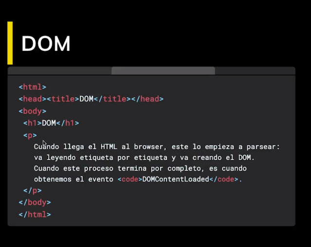

El navegador interpreta el archivo HTML y cuando termina de transformarlo al DOM se dispara el evento **DOMContentLoaded** lo que significa que todo el documento está disponible para ser manipulado.

Luego lo va a convertir a una estructura de arbol como la siguiente 

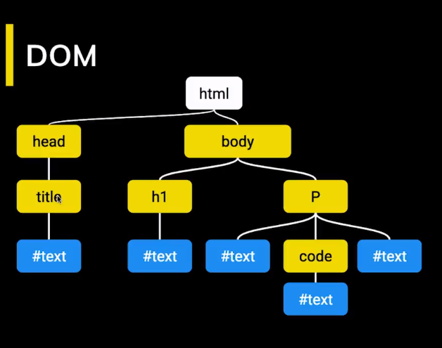

Cuando la estructura se termina de cargar es cuando aparece el **DOMContentLoaded**

Todo script que carguemos en nuestra página tiene un llamado y una ejecución.

Tanto con **async** como **defer** podemos hacer llamados asíncronos pero tiene sus diferencias:

- **async.** Con async podemos hacer la petición de forma asíncrona y no vamos a detener la carga del DOM hasta que se haga la ejecución del código.

- **defer.** La petición es igual asíncrona como en el async pero va a deferir la ejecución del Javascript hasta el final de que se cargue todo el documento.

Hay que tener en cuenta que cuando carga una página y se encuentra un script a ejecutar toda la carga se detiene. Por eso se recomienda agregar tus scripts justo antes de cerrar el body para que todo el documento esté disponible.

La razon de que se detenga es porque el script esta al principio de body y no al final. Entonces no permite que el **DOM** cargue correctamente, es decir no termina de hacer la ejecución por completo. 

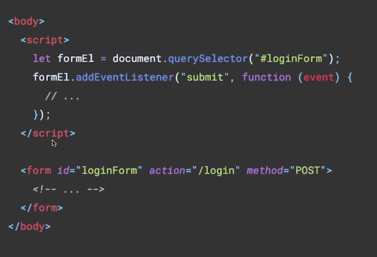

Para que no se genere un error en el navegador la solucion esta en colocar el script finalizando el body de esta forma

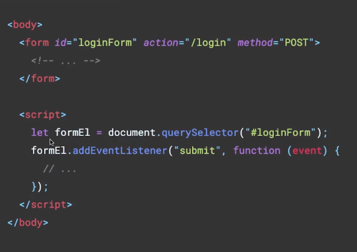

El navegador siempre va a leer el codigo de arriba hacia a bajo, en el primer caso form esta despues del script y por tanto se genera un error porque aun no reconoce que es la etiqueta form.

Caso contrario en el segundo ejemplo, ejecuta form y cuando se ejecuta el script ya sabe a que elemento esta haciendo el llamado 

___

Tambien existen los scripts externos que pueden ser documentos que existan en internet en forma de cdn o tener scripts externos locales que se van a mandar a llamar o ha hacer la peticion a traves del atributo source `src`

Existen scripts que se pueden utilizar con la funcion **async**, lo que representa la linea amarilla es la ejecución del html. async permite que se ejecute el codigo html y al mismo timepo este ocurriendo el Script Fetching, es decir se carga el html mientras se esta haciendo el llamado al script pero en el momento que se tiene que ejecutar el script se detiene, lo resuelve y luego continua con su ejecución

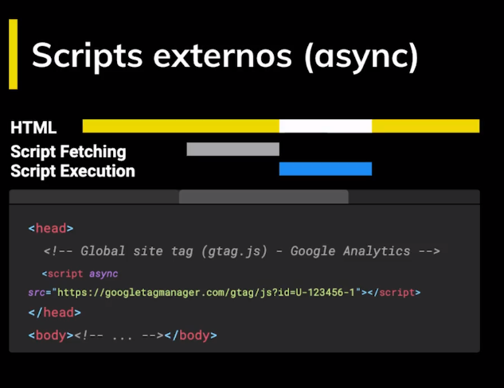

Existe un orden de ejecucion que lo que quiere decir es que si un script es mas pequeño que otro mas grande primero se va a ejecutar el mas pequeño y luego el grande

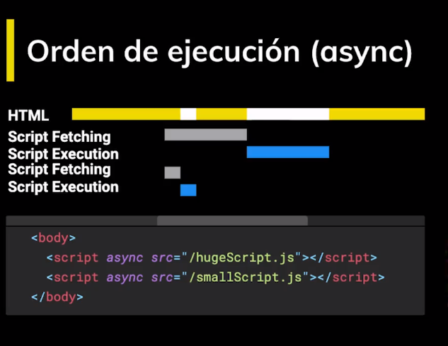

La otra forma que existe para traer script externos es con la funcion **defer** y lo que va a hacer es a ejecutar todo el html primero, hace la peticion y por ultimo va a realizar la ejecucion del script

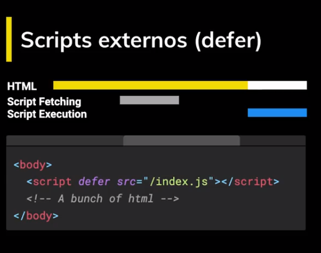

para verlo en el proyecto en la carpeta **assets** crear el archivo **index.js**

En el archivo se va a copiar todo el codigo que antes estaba dentro de las etiquetas `<script></script>` del archivo **index.html** 

**index.js**

```
class MediaPlayer {
    constructor(config){
      this.media = config.movie;
    }
    
    play(){
      this.media.play();
    }
    
    pause(){
      this.media.pause();
    }
    
    ejec(){
      if(this.media.paused){
        this.play();
      }else{
        this.pause();
    }
  }
}
  
  const video = document.querySelector('video');
  const button = document.querySelector('button');
  const player = new MediaPlayer({ movie : video})
  
  button.onclick = () => player.ejec()
```

y ahora en **index.html** en la etiqueta `<script>` se añade el atributo src y la ruta del archivo que ahora es externo

`<script src="/assets/index.js"></script>` , se podria añadir `async` o `defer` pero como la etiqueta script esta hasta el final de todo el contenido html no es necesario hacerlo

**index.html**

```
<html>
  <head>
    <title>PlatziMediaPlayer.js</title>
    <link
      rel="stylesheet"
      href="https://necolas.github.io/normalize.css/8.0.1/normalize.css"
    />
    <link rel="stylesheet" href="./assets/index.css" />
  </head>

  <body>
    <header>
      <h1>PlatziMediaPlayer.js</h1>
      <p>An extensible media player.</p>
    </header>

    <main class="container">
      <video class="movie">
        <source src="./assets/BigBuckBunny.mp4" />
      </video>

      <button>Play/Pause</button>
    </main>

    <script src="/assets/index.js"></script>
  </body>
</html>
```

Confirmar que todo siga funcionando como en el capitulo anterior con el reto de dar play y pausar el video

## Scope

El Scope o ámbito es lo que define el tiempo de vida de una variable en la que esta existe, en que partes de nuestro código pueden ser usadas.

**Global Scope**

Variables disponibles de forma global se usa la palabra var, son accesibles por todos los scripts que se cargan en la página. Aquí hay mucho riesgo de sobreescritura.

**Function Scope**

Variables declaradas dentro de una función sólo visibles dentro de ella misma (incluyendo los argumentos que se pasan a la función).

**Block Scope**

Variables definidas dentro de un bloque, por ejemplo variables declaradas dentro un loop while o for. Se usa let y const para declarar este tipo de variables.

**Module Scope**

Cuando se denota un script de tipo module con el atributo type="module las variables son limitadas al archivo en el que están declaradas.

Para ver esto crear una carpeta que se llame **ejercicios** y dentro de estos crear otro archivo **index.html** y **scope.html**

dentro de **index.html** agregar lo siguiente

```
<head>
    <html>
      <title>Curso Profesional de JavaScript: Ejercicios</title>
    </head>
  
    <body>
      <a href="/">Go back</a>
      <h1>Índice</h1>
      <ol>
        <li><a href="/ejercicios/scope.html">Scope</a></li>
      </ol>
    </body>
  </html>
```

dentro de **scope.html** agregar lo siguiente

```
<html>
    <head>
        <title>Scope</title>
    </head>

    <body>
        <a href="/ejercicios/">Go Back</a>
        <p><em>Abre la consola</em></p>

        <script>
            //Global Scope
            //Function Scope
            //Block Scope
            //Module Scope
        </script>
    </body>
</html>
```


En el navegador colocar la siguiente ruta http://127.0.0.1:8080/ejercicios/ y dentro de esta seleccionar **Scope** se vera algo asi abriendo la consola con  **ctrl + shift + i**

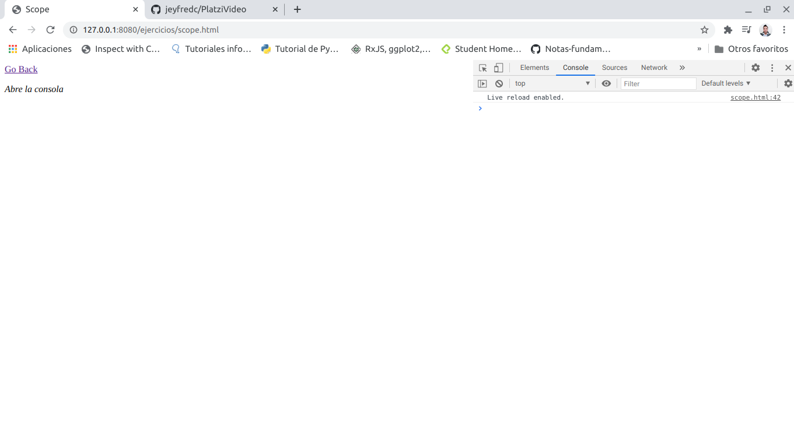

Si dentro del archivo scope se crea una variable message que diga `Hello,Friends`

```
        <script>
            //Global Scope
            var message = 'Hello, Friends';
            //Function Scope
            //Block Scope
            //Module Scope
        </script>
```

mientras tanto en la consola del navegador se escribe window.message

va a aparecer lo que se guardo dentro de la variable pero esta aparece porque esta en el scope global. window hace referencia al ambito global.

Toda variable que este por fuera de un bloque de codigo va a quedar en el scope global

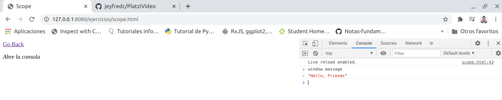

Con la palabra var ocurre algo particular y es que se declara globalmente ahora el ejemplo sera para una Function Scope

```
        <script>
            //Global Scope
            //var message = 'Hello, Friends';
            //Function Scope
            function printNumbers() {
                for(var i = 0; i<10; i++){
                    setTimeout(function(){
                        console.log(i);
                    }, 1000);
                }
            }

            printNumbers();
            //Block Scope
            //Module Scope
        </script>
```

Con esta declaracion lo que se esperaria es que el navegador imprima los numeros del 1 al 9 despues de 1 segundo, la funcion setTimeOut recibe 2 parametros una funcion y un tiempo en milisegundos pero lo que ocurre a continuacion es que se imprime la iteracion 10 vecesy no muestra lo numeros del 0 al 9

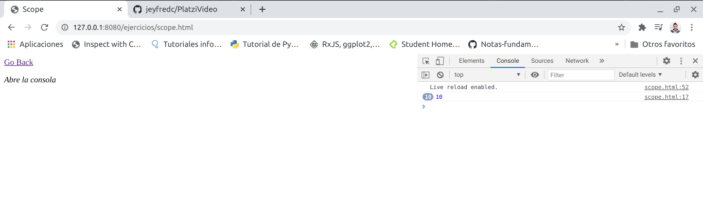

esto pasa porque al utilizar la palabra var es como si i no valiera nada pero al asignarse, automaticamente hace el recorrido y llega a 10 sin mostrar el resto de numeros que se quieren imprimir, es decir que los numeros se reasignan en i en cada iteracion pero no muestra su recorrido

```
var i;
function printNumbers() {
    for(i = 0; i<10; i++){
        setTimeout(function(){
            console.log(i);
        }, 1000);
    }
}
```

para solucionarlo hay que crear una **Function Scope** interna que imprima cada iteracion que hace sobre el ciclo de esta forma para que al hacer el recorrido en cada iteracion permita pasar por el numero 0, termine de ejecutar la funcion y luego continue y despues pase por el numero 1 y hace hasta llegar a las 10 iteraciones

```
        <script>
            //Global Scope
            var message = 'Hello, Friends';
            //Function Scope
            function printNumbers() {
                var i;
                for(i = 0; i<10; i++){
                    function eventuallyPrintNumber(n){
                        setTimeout(function(){
                            console.log(n);
                        }, 1000);
                    }
                    eventuallyPrintNumber(i)
                }
            }

            printNumbers();
            //Block Scope
            //Module Scope
        </script>
```

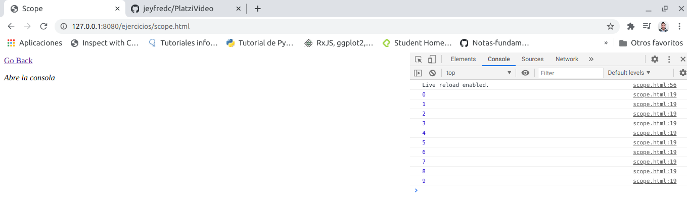

Existen 2 palabras reservadas en JavaScript que operan sobre el **Block Scope** y se llaman `let` que sirve para asignacion de variables y `const` para crear constantes en el ejemplo a continuacion no se va a usar `const` porque se generaria un error al iterar por ser una constante 

```
        <script>
            //Global Scope
            //var message = 'Hello, Friends';
            ////Function Scope
            //function printNumbers() {
            //    var i;
            //    for(i = 0; i<10; i++){
            //        function eventuallyPrintNumber(n){
            //            setTimeout(function(){
            //                console.log(n);
            //            }, 1000);
            //        }
            //        eventuallyPrintNumber(i)
            //    }
            //}

            //printNumbers();
            //Block Scope

            function printNumbers2() {
                for(let i = 0; i<10; i++){
                    setTimeout(function(){
                        console.log(i);
                    }, 1000);
                }
            }

            printNumbers2();

            //Module Scope
        </script>
```

En este caso con let cada vez que se ejecuta una iteracion ocurre dentro del bloque de codigo, y al iterar y hacer el recorrido es como si se creara un nuevo bloque y por tanto se imprimen los numeros del 0 al 9 


Ahora en el caso de Modul Scope, existe una forma de proteger o encapsular las variables que existian en la clase MediaPlayer para esto en el archivo **index.html** del proyecto escribir `type="module"` en el script asi dejando la ruta que estaba llamando el archivo

`<script type="module" src="/assets/index.js"></script>`

En el navegador antes se podia acceder a los atributos video, MediaPlayer, etc. pero utilizando module no permite mas el acceso a estas variables, la ejecucion del video va a seguir siendo la misma, pero esto se creo para empezar a modularizar partes de un archivo en varios y de esta forma tener codigo mas legible.

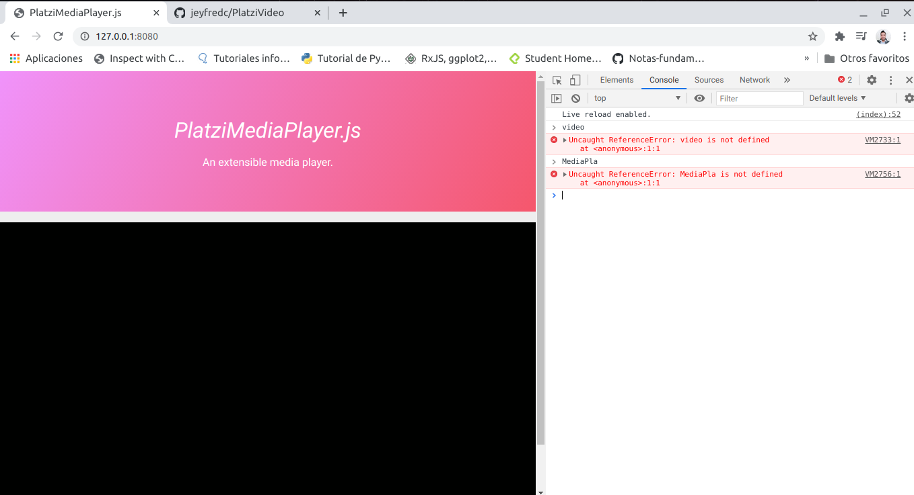

Para esto crear un nuevo archivo en la carpeta **assets** que se llame **MediaPlayer.js** y pasar todo lo que corresponde a la clase MediaPlayer.

Despues mediante la palabra `export default MediaPlayer;` se va a exportar el archivo hacia otro que lo llame en la ruta

```
class MediaPlayer {
    constructor(config){
      this.media = config.movie;
    }
    
    play(){
      this.media.play();
    }
    
    pause(){
      this.media.pause();
    }
    
    ejec(){
      if(this.media.paused){
        this.play();
      }else{
        this.pause();
    }
  }
}

export default MediaPlayer;
```

Dejando esto, **index.js** quedaria de la siguiente forma donde se utiliza la palabra `import MediaPlayer from './MediaPlayer.js'` para llamar al otro archivo y poder hacer uso de este.

```
import MediaPlayer from './MediaPlayer.js'

const video = document.querySelector('video');
const button = document.querySelector('button');
const player = new MediaPlayer({ movie : video})

button.onclick = () => player.ejec()
```

De esta forma queda modularizado todo el codigo que antes se habia creado

## Closures

Son funciones que regresan una función o un objeto con funciones que mantienen las variables que fueron declaradas fuera de su scope.

Los closures nos sirven para tener algo parecido a variables privadas, característica que no tiene JavaScript por default. Es decir encapsulan variables que no pueden ser modificadas directamente por otros objetos, sólo por funciones pertenecientes al mismo.

para esto modificar **index.html** que esta en la carpeta de **ejercicios** y añadir lo siguiente debajo de la etiqueta de scope

`<li><a href="/ejercicios/clausures.html">clausures</a></li>`

y crear un archivo dentro de la carpeta que se llame **closures.html** y agregar lo siguiente

```
<html>
    <head>
        <title>Closures</title>
    </head>

    <body>
        <a href="/ejercicios/">Go Back</a>
        <p><em>Abre la consola</em></p>

        <script>
            //Clousures
            //printColor

            let color = 'green';

            function printColor() {
                console.log(color);
            }

            printColor();
        </script>
    </body>
</html>
```

Nuevamente ingresar en el navegador a la ruta http://127.0.0.1:8080/ejercicios/ y seleccionar **closures**

si en la consola del navegador se escribe color aparece la palabra "green" lo que quiere decir que esta disponible globalmente 

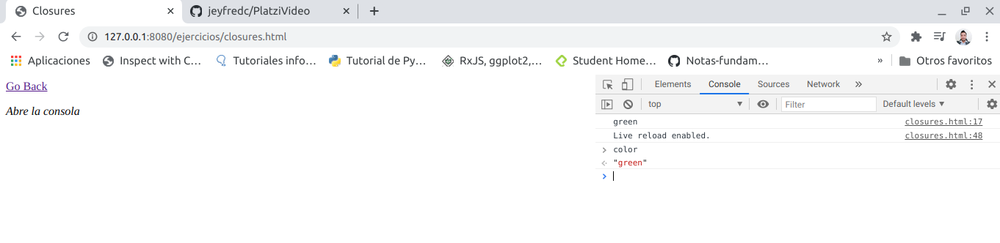

para evitar que pase eso hay que crear una funcion que se va a llamar automaticamente esto tiene el termino de IIFE(function expression executed immediately) es decir una expresion de funcion ejecutada inmediatamente, se hace creando una funcion y encerrandola dentro de un parentesis como se ve a continuacion

```
        <script>
            //Clousures
            //printColor

            //IIFE
            (function () {
                let color = 'green';
    
                function printColor() {
                    console.log(color);
                }
    
                printColor();
            })();
        </script>
```

ahora color ya no puede pasar al scope  global porque quedo dentro de una funcion que se llama asi misma y la palabra let solo esta disponible dentro del bloque de codigo la funcion tiene una variable color y la funcion `printColor` la cual esta dentro de la funcion solamente tiene acceso a la variable color pero lo que este por fuera no tiene acceso a esta variable

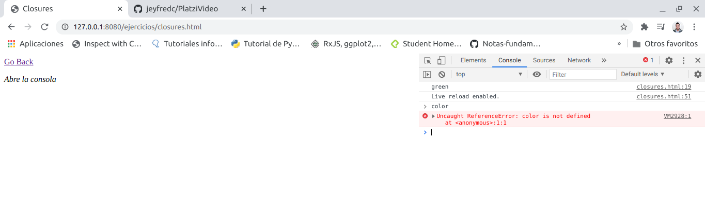

Ahora estan las funciones que regresan funciones 

la funcion MakeColor recibe como parametro un color, su variable interna que es colorMessage recibe un string y la variable que esta declarada como parametro y luego retorna la funcion con el string y el parametro que se haya pasado por color.

Fuera de la funcion se crea una variable que recibe a la funcion MakeColorPrinter y alli se pasa el parametro del color que para este caso es red y a traves de la constante creada se imprime la funcion


```
        <script>
            //Clousures
            //printColor

            //IIFE
            //(function () {
            //    let color = 'green';

            //    function printColor() {
            //        console.log(color);
            //    }

            //    printColor();
            //})();

            // Funciones que regresan funciones

            function makeColorPrinter(color) {
                let colorMessage = `The color is ${color}`;

                return function() {
                    console.log(colorMessage);
                };
            }

            let redColorPrinter = makeColorPrinter('red');
            console.log(redColorPrinter());

        </script>
```

De esta forma se tiene acceso al scope al hacer el llamado de la funcion pero no al scope de la variable y a esto se le llama closures

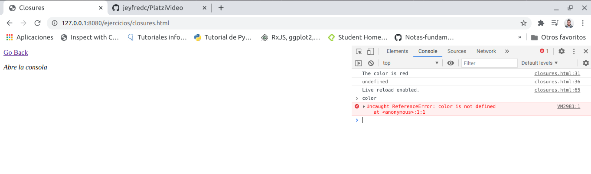

Por ultimo estan las variables privadas 

En este ejemplo se crea un array que dentro de este esta el valor count y se puede acceder desde el navegador al hacer un `console.log`

```
        <script>
            //Clousures
            //printColor

            //IIFE
            //(function () {
            //    let color = 'green';

            //    function printColor() {
            //        console.log(color);
            //    }

            //    printColor();
            //})();

            // Funciones que regresan funciones

            //function makeColorPrinter(color) {
            //    let colorMessage = `The color is ${color}`;

            //    return function() {
            //        console.log(colorMessage);
            //    };
            //}

            //let redColorPrinter = makeColorPrinter('red');
            //console.log(redColorPrinter());

            // Variables "privadas"
            const counter = {
                count: 3,
            };

            console.log(counter.count);
            
        </script>
```

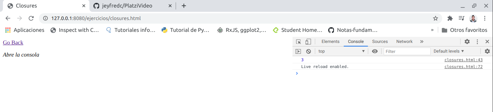

y si se quiere reasignar la variable tambien se puede hacer asi 

```
const counter = {
    count: 3,
}
console.log(counter.count);
counter.count = 99;
console.log(counter.count);
```


si se quisiera evitar que se acceda a la variable se hace lo siguiente

crear una funcion que recibe como parametro a n que es un numero y se retornan varias funciones pero por si solo no permite acceder ni cambiar la variable por otro numero

```
        <script>
            //Clousures
            //printColor

            //IIFE
            //(function () {
            //    let color = 'green';

            //    function printColor() {
            //        console.log(color);
            //    }

            //    printColor();
            //})();

            // Funciones que regresan funciones

            //function makeColorPrinter(color) {
            //    let colorMessage = `The color is ${color}`;

            //    return function() {
            //        console.log(colorMessage);
            //    };
            //}

            //let redColorPrinter = makeColorPrinter('red');
            //console.log(redColorPrinter());

            // Variables "privadas"
            //const counter = {
            //    count: 3,
            //};

            //console.log(counter.count);

            function makeCounter(n) {
                let count = n;

                return {
                    increase: function () {},
                    decrease: function () {},
                    getCount: function () {},
                };
            }

            let counter = makeCounter(5);

            console.log(counter.count);
            
        </script>
```

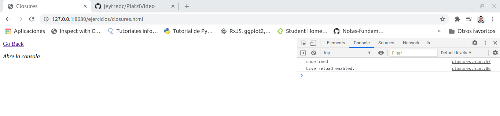

pero para acceder a la variable se puede agregar funcionalidad a cada una y acceder a la variable a traves de la funcion asi 

```
        <script>
            //Clousures
            //printColor

            //IIFE
            //(function () {
            //    let color = 'green';

            //    function printColor() {
            //        console.log(color);
            //    }

            //    printColor();
            //})();

            // Funciones que regresan funciones

            //function makeColorPrinter(color) {
            //    let colorMessage = `The color is ${color}`;

            //    return function() {
            //        console.log(colorMessage);
            //    };
            //}

            //let redColorPrinter = makeColorPrinter('red');
            //console.log(redColorPrinter());

            // Variables "privadas"
            //const counter = {
            //    count: 3,
            //};

            //console.log(counter.count);

            function makeCounter(n) {
                let count = n;

                return {
                    increase: function () {},
                    decrease: function () {},
                    getCount: function () {
                        return count;
                    },
                };
            }

            let counter = makeCounter(5);

            console.log(counter.getCount());
            
        </script>
```

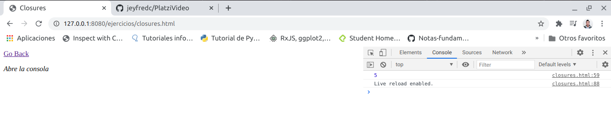

completando cada funcion esto es lo que se podria hacer, pero de ninguna forma se podria re asignar la variable como se habia hecho en el ejemplo sin establecer funciones

```
            function makeCounter(n) {
                let count = n;

                return {
                    increase: function () {
                        return count = count +1 ;
                    },
                    decrease: function () {
                        return count = count -1 ;
                    },
                    getCount: function () {
                        return count;
                    },
                };
            }

            let counter = makeCounter(5);

            console.log('The count is ', counter.getCount());
            counter.increase();
            console.log('The count is ', counter.getCount());
            counter.decrease();
            counter.decrease();
            counter.decrease();
            counter.decrease();
            console.log('The count is ', counter.getCount());

            counter.count = 0;
            console.log('The count is ', counter.getCount());
```

La razon de que aparezca dos veces el numero 2 es porque la variable no se dejo re asignar y con `counter.increase()` aumento la primer vez el numero a 6 y luego se ejecuto cuatros veces `counter.decrease();` y por eso la funcion quedo en 2

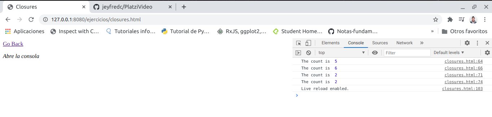

## El primer plugin

Abrir el archivo **MediaPlayer.js** 

1. se crea la propiedad de plugins para poder acceder a traves de un array `this.plugins = config.plugins || [];`

2. se inicializa el metodo `this.initPlugins();` dentro del constructor que posteriormente se va a crear

```
class MediaPlayer {
    constructor(config){
      this.media = config.movie;
      this.plugins = config.plugins || [];
      this.initPlugins();
    }

    initPlugins(){
      this.plugins.forEach(plugin => {
        plugin.run(this)
      });
    }
    
    play(){
      this.media.play();
    }
    
    pause(){
      this.media.pause();
    }
    
    mute(){
      this.media.muted = true;
    }

    unmute(){
      this.media.muted = false;
    }
    ejec(){
      if(this.media.paused){
        this.play();
      }else{
        this.pause();
    }


  }
}

export default MediaPlayer;
```

3. se crear el metodo initPlugins

```
initPlugins(){
  this.plugins.forEach(plugin => {
    plugin.run(this)
  });
  }

```

4. se crea el metodo muted y unmuted 

```
    mute(){
      this.media.muted = true;
    }

    unmute(){
      this.media.muted = false;
    }
```

5. dentro de la carpeta **assets** del pryecto se crea una subcarpeta llamada **plugins** y dentro de esta se crea el archivo **AutoPlay.js** el cual contiene a la clase `AutoPlay` y el metodo `run()`, el cual ejecuta la instancia de MediaPLayer a traves de player con los metodos mute y play para que cuando el navegador se abra automaticamente empiece a reproducirse sin sonido

```
class AutoPlay {
    run(player){
        player.mute()
        player.play()
    }
}

export default AutoPlay;
```

6. Por ultimo se importa la clase AutoPlay a **index.js** y la instancia queda creada con player que es la misma que utiliza MediaPlayer

```
import MediaPlayer from './MediaPlayer.js'
import AutoPlay from './plugins/AutoPlay.js'

const video = document.querySelector('video');
const button = document.querySelector('button');
const player = new MediaPlayer({ movie : video, plugins : [new AutoPlay()] })

button.onclick = () => player.ejec()
```

por ultimo abrir el navegador y verificar que el video este sin sonido y se reproduzca automaticamente

**Reto:** Añadir un nuevo boton a la interfaz el cual es el boton de **mute**, para que cuando el video comience el usuario pueda dar unmute y pueda escuchar el video

## this

this se refiere a un objeto, ese objeto es el que actualmente está ejecutando un pedazo de código.

No se puede asignar un valor a this directamente y este depende de en que scope nos encontramos:

- Cuando llamamos a this en el **Global Scope** o **Function Scope**, se hace referencia al objeto window. A excepción de cuando estamos en **strict mode** que nos regresará undefined.

- Cuando llamamos a this desde una función que está contenida en un objeto, this se hace referencia a ese objeto.

- Cuando llamamos a this desde una **“clase”**, se hace referencia a la instancia generada por el constructor.

Abrir **index.js** y comentar la instalancia de plugins asi para no utilizar el plugin adaptado en la clase anterior que era hacer autoplay al recargar la pagina

```
import MediaPlayer from './MediaPlayer.js'
import AutoPlay from './plugins/AutoPlay.js'

const video = document.querySelector('video');
const button = document.querySelector('button');
const player = new MediaPlayer({ movie : video, //plugins : [new AutoPlay()] 
})

button.onclick = () => player.ejec()
```

Ahora en la carpeta de **ejercicios** crear un nuevo archivo que se llame **this.html** y agregar lo siguiente 

```
<html>
    <head>
        <title>This</title>
    </head>

    <body>
        <a href="/ejercicios/">Go Back</a>
        <p><em>Abre la consola</em></p>

        <h1>
            <code>this</code> se refiere a un objeto. Ese objeto es el que actualmente está ejecutando un pedazo de código</h1>

        <script>
            // this en el scope global
            //this en el scope de una funcion
            // this en el scope de una funcion en strict mode
            // this en el contexto de un objeto
            // this cuando sacamos una funcion de un objeto
            // this en el contexto de una clase
        </script>
    </body>
</html>
```

y en el **index.html** de la carpeta ejercicios añadir la siguiente linea de codiga despues de closures

`<li><a href="/ejercicios/this.html">this</a></li>`

Ahora en el navegador abrir la ruta http://127.0.0.1:8080/ejercicios/ y seleccionar this y abrir la consola 

**this** es un concepto que tienen muchos lenguajes de programacion, sobre todo los que son orientados a objetos.

this se refiere a la instancia de una clase cuando se crea un objeto y generalmente se escribe **this.nombredepropiedad** o **this.nombredemetodo** lo que quiere decir que ese objeto tiene acceso ya sea a una propiedad o a un metodo.

En JavaScript ocurre lo mismo pero tambien hay otros contextos que se deben conocer para saber en que momento this se comporta de una manera u obtiene valores diferentes 

- this en el scope global -> es cuando esta entre etiquetas, no hay ninguna funcion, no hay ningun objeto 

en el archivo **this.html** entre los scripts empezar a colocar 

```
        <script>
            // this en el scope global
            console.log(`this: ${this}`);
            //this en el scope de una funcion
            // this en el scope de una funcion en strict mode
            // this en el contexto de un objeto
            // this cuando sacamos una funcion de un objeto
            // this en el contexto de una clase
        </script>
```

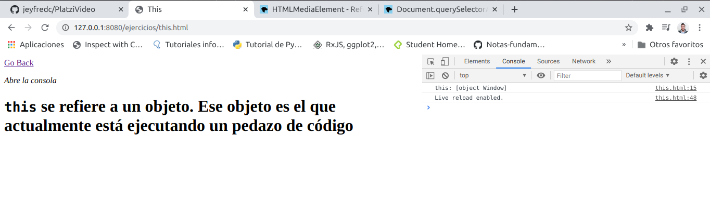

sale que this es un objeto y que ese objeto es window, el navegador cuando this esta en el contexto global siempre lo va a asignar a window

- this en el scope de una funcion

```
        <script>
            // this en el scope global
            console.log(`this: ${this}`);
            //this en el scope de una funcion
            function whoIsThis(){
                return this;
            }

            console.log(`whoIsThis(): ${whoIsThis()}`);
            // this en el scope de una funcion en strict mode
            // this en el contexto de un objeto
            // this cuando sacamos una funcion de un objeto
            // this en el contexto de una clase
        </script>
```

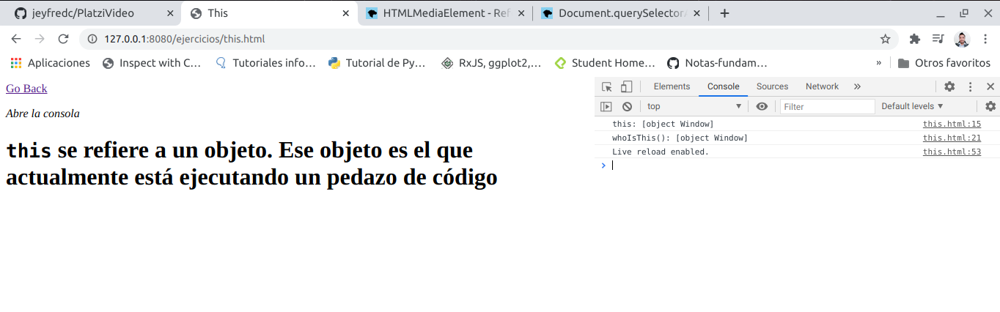

En este caso el motor de JavaScript tambien lo asigna a window porque esta llamando la funcion directamente

- this en el scope de una funcion en strict mode y este se enciende con esta sintaxis `"use strict",`, en este caso se coloca dentro de la funcion

```
        <script>
            // this en el scope global
            console.log(`this: ${this}`);
            //this en el scope de una funcion
            function whoIsThis(){
                return this;
            }

            console.log(`whoIsThis(): ${whoIsThis()}`);
            // this en el scope de una funcion en strict mode
            function whoIsThisStrict(){
                "use strict";
                return this;
            }

            console.log(`whoIsThisSctrict(): ${whoIsThisStrict()}`);
            // this en el contexto de un objeto
            // this cuando sacamos una funcion de un objeto
            // this en el contexto de una clase
        </script>
```

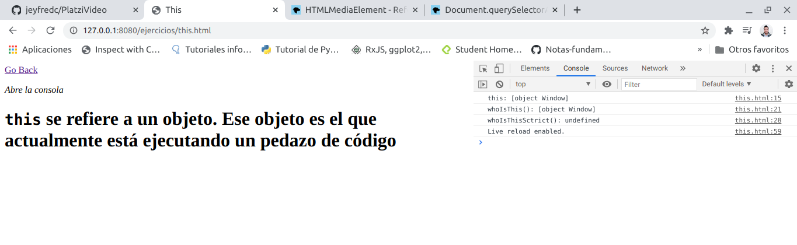

this en `whoIsThisSctrict()` es undefined y es el comportamiento que debe tener al usar el strict mode el cual sirve para evitar errores 

- this en el contexto de un objeto

```
        <script>
            // this en el scope global
            console.log(`this: ${this}`);
            //this en el scope de una funcion
            function whoIsThis(){
                return this;
            }

            console.log(`whoIsThis(): ${whoIsThis()}`);
            // this en el scope de una funcion en strict mode
            function whoIsThisStrict(){
                "use strict";
                return this;
            }

            console.log(`whoIsThisSctrict(): ${whoIsThisStrict()}`);
            // this en el contexto de un objeto
            const person= {
                name: 'Jeyfred',
                saludar(){
                    console.log(`Hola soy ${this.name}`);
                }
            }

            person.saludar();

            // this cuando sacamos una funcion de un objeto
            // this en el contexto de una clase
        </script>
```

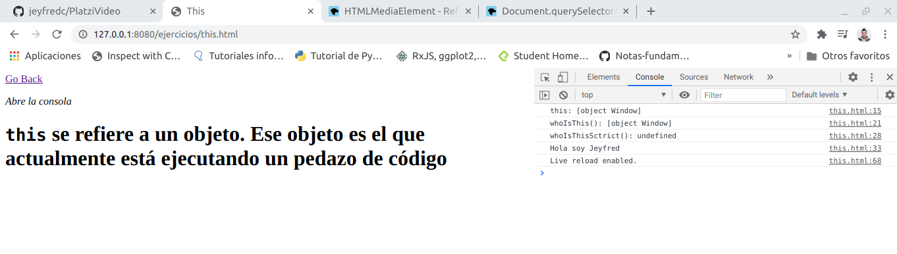

En este caso la funcion saludar la esta ejecutando el objeto person y cuando se escribe `{this.name}` se refiere al objeto que se esta ejecutando dentro de si mismo por lo tanto this es todo el objeto person

- this cuando sacamos una funcion de un objeto

```
        <script>
            // this en el scope global
            console.log(`this: ${this}`);
            //this en el scope de una funcion
            function whoIsThis(){
                return this;
            }

            console.log(`whoIsThis(): ${whoIsThis()}`);
            // this en el scope de una funcion en strict mode
            function whoIsThisStrict(){
                "use strict";
                return this;
            }

            console.log(`whoIsThisSctrict(): ${whoIsThisStrict()}`);
            // this en el contexto de un objeto
            const person= {
                name: 'Jeyfred',
                saludar(){
                    console.log(`Hola soy ${this.name}`);
                }
            }

            person.saludar();

            // this cuando sacamos una funcion de un objeto

            const accion = person.saludar;
            accion();
            // this en el contexto de una clase
        </script>
```

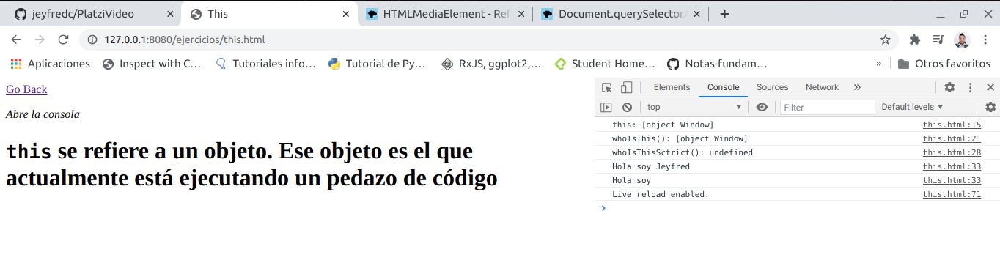

Ahora el navegador solo ejecuta **Hola soy** y es porque accion no se esta llamando dentro del contexto de un objeto  si no que se esta llamando directamente y en ese caso `{this.name}` ya no existe 

- this en el contexto de una clase

```
        <script>
            // this en el scope global
            console.log(`this: ${this}`);
            //this en el scope de una funcion
            function whoIsThis(){
                return this;
            }

            console.log(`whoIsThis(): ${whoIsThis()}`);
            // this en el scope de una funcion en strict mode
            function whoIsThisStrict(){
                "use strict";
                return this;
            }

            console.log(`whoIsThisSctrict(): ${whoIsThisStrict()}`);
            // this en el contexto de un objeto
            const person= {
                name: 'Jeyfred',
                saludar(){
                    console.log(`Hola soy ${this.name}`);
                }
            }

            person.saludar();

            // this cuando sacamos una funcion de un objeto

            const accion = person.saludar;
            accion();
            // this en el contexto de una clase
            class Person{
                constructor(name){
                    this.name = name;
                }
                saludar(){
                    console.log(`Me llamo ${this.name}`);
                }
            }

            const carlos = new Person('carlos');

            carlos.saludar();
        </script>
```

En este caso se crea una clase y en el constructor se le pasa el parametro name, al pasar `this.name = name;` significa que al objeto Person se le esta asignando un atributo name que es igual al constructor, despues se crea el metodo `saludar()` y este metodo tiene acceso a al atributo de la clase, posteriormente despues de cerrar la clase se crea un objeto carlos que es de tipo Person que despues a traves del objeto carlos llama al metodo saludar y lo ejecuta. En este caso **this** se refiere a la instancia del objeto el cual es carlos mas no a la clase que es Person