# PlatziVideo

## Tabla de contenido 

[Inicio del proyecto](#Inicio-del-proyecto)

[Cómo llega un script al navegador](#Cómo-llega-un-script-al-navegador)

[Scope](#Scope)

[Closures](#Closures)

[El primer plugin](#El-primer-plugin)

[this](#this)

[Los métodos call, apply y bind](#Los-métodos-call-apply-y-bind)

[Prototype](#Prototype)

[Herencia Prototipal](#Herencia-Prototipal)

[Parsers y el Abstract Syntax Tree (Analizador y arbol de sintaxis abstracta)](#Parsers-y-el-Abstract-Syntax-Tree-(Analizador-y-arbol-de-sintaxis-abstracta))

[Abstract Syntax Tree en Práctica](#Abstract-Syntax-Tree-en-Práctica)

[Cómo funciona el JavaScript Engine](#Cómo-funciona-el-JavaScript-Engine)

[Event Loop](#Event-Loop)

[Promesas](#Promesas)

[Getters y setters](#Getters-y-setters)

[Proxy](#Proxy)

[]()

[]()

[]()

[]()

[]()

[]()

[]()

[]()

[]()

[]()

[]()

[]()

## Inicio del proyecto

Trabajaremos en el proyecto PlatziVideo, una plataforma de vídeo.

Esta es la base de nuestro proyecto y nos vamos a enfocar en el MediaPlayer. Durante el curso se desarrollarán plugins de forma modular para extender la funcionalidad del MediaPlayer.

El repositorio de este curso lo encuentras en: https://github.com/platzi/javascript-profesional

**Nota:** El repositorio esta completo, para iniciarlo desde el principio lo primero que hay que hacer es clonarlo y luego ir al commit en el que empieza todo con el siguiente comando en la terminal

`git reset ff1badc05e00be6bb018bf3e5705ba672e20821f --hard`

___

Para empezar lo primero que hay que hacer es abrir la terminal y en la ubicacion del proyecto escribir lo siguiente

`npm init -y`

Al ejecutar esto en la terminal lo que hace es crear una carpeta llamada **package.json** con informacion pero si se quiere se puede cambiar por la siguiente aclarado, que el `author` y `description` debe ser el de la persona que lo realice

{
  "name": "Curso-javascript-profesional",
  "version": "1.0.0",
  "description": "PlatziVideo",
  "license": "MIT",
  "author": "Jeyfred Calderon <jeyfredc@gmail.com>",
  "keywords": [
    "platzi"
  ],
  "scripts": {},
  "devDependencies": {}
}

A continuacion en la terminal hacer la instalacion de live-server con el siguiente comando

`npm i -D live-server`

la `i` es de `install`, la bandera D `-D` quiere decir que este proyecto es solo para desarrollo y no se va a utilizar para produccion y `live-server` es la herramienta que ayudara a cargar el archivo **index.html** en el navegador

Al realizar la instalacion lo que va a hacer es que en el archivo **package.json** en la parte de `devDependencies` se encuentre instalada live-server y para poder usarla en los `scripts` se va a dejar un comando para inicializar live-server

```
{
  "name": "Curso-javascript-profesional",
  "version": "1.0.0",
  "description": "PlatziVideo",
  "license": "MIT",
  "author": "Jeyfred Calderon <jeyfredc@gmail.com>",
  "keywords": [
    "platzi"
  ],
  "scripts": {
    "start": "live-server"
  },
  "devDependencies": {
    "live-server": "^1.2.1"
  }
}
```

para usarlo en la terminal ejecutar el siguiente comando 

`npm start `

Automaticamente se va a abrir el archivo **index.html** en el navegador


la ruta que aparece es **127.0.0.1:8080** es lo mismo que escribir **localhost:8080**

En el archivo **index.html** añadir las etiquetas de script para empezar a ejecutar y compilar el codigo de bajo de la etiqueta que cierra main `</main>`

```
<html>
  <head>
    <title>PlatziMediaPlayer.js</title>
    <link
      rel="stylesheet"
      href="https://necolas.github.io/normalize.css/8.0.1/normalize.css"
    />
    <link rel="stylesheet" href="./assets/index.css" />
  </head>

  <body>
    <header>
      <h1>PlatziMediaPlayer.js</h1>
      <p>An extensible media player.</p>
    </header>

    <main class="container">
      <video class="movie">
        <source src="./assets/BigBuckBunny.mp4" />
      </video>

      <button>Play/Pause</button>
    </main>

    <script>

    </script>
  </body>
</html>

```

En la carpeta **assets** del proyecto existe un video llamado **BigBuckBunny.mp4** para poder traerlo al documento se hace lo siguiente dentro de las etiquetas scripts

1. Se crea una constante video y se llama a la etiqueta `<video>` del html para poder hacer uso de ella, por el momento es la unica etiqueta que existe en el html a traves de un `querySelector` que representa un elemento o varios

2. Se crea una constante button y se llama a la etiqueta `<button>` del html para poder hacer uso de ella, por el momento es la unica etiqueta que existe en el html

3. Como el boton ya esta a la escucha de una instruccionse indica que por medio de un click el video haga play. El atributo `video.play` se utiliza sabiendo que todos los elementos del DOM(Document Object Model) tienen un API(Application programming interface). Si se quiere saber cuales son los atributos de video se puede buscar en [mdn htmlmediaelement](https://developer.mozilla.org/es/docs/Web/API/HTMLMediaElement)

```
      const video = document.querySelector("video")
      const button = document.querySelector("button")

      button.onclick = () => video.play();
```

Si se comentara la linea `//button.onclick = () => video.play();` y luego se colocara `video.play();` lo que va a pasar es que la consola del navegador va a mostrar el error **(index):31 Uncaught (in promise) DOMException**


Este error se muestra para evitar que en los navegadores el video se empiece a reproducir solo

Descomentando la linea, el usuario puede dar click en el boton play en el navegador pero hay que buscar que se haga mas extensible el codigo para esto se crea una clase y el codigo queda de la siguiente forma

1. Se crea la clase MediaPlayer

2. Se crea el constructor con el parametro config y utilizando `media` se llama a la funcion play en el metodo `play(){}`

3. Se instancia la clase MediaPLayer a traves de la constante player pasando como parametro al elemento video

4. por medio de la funcion `button.onclick()` se manda a llamar al metodo `play()`

```
    <script>
      const video = document.querySelector("video")
      const button = document.querySelector("button")

      class MediaPlayer {
        constructor(config){
          this.media = config.movie
        }
        play(){
          this.media.play()
        }

      }

      const player = new MediaPlayer({ movie: video})

      button.onclick = () => player.play();


    </script>
```

**Nota:** Queda como reto añadir la funcionalidad para que el video haga pausa, es importante apoyarse de la documentacion que existe [mdn htmlmediaelement](https://developer.mozilla.org/es/docs/Web/API/HTMLMediaElement)

<div align="right">
  <small><a href="#tabla-de-contenido">🡡 volver al inicio</a></small>
</div>

## Cómo llega un script al navegador

El **DOM** es la representación que hace el navegador de un documento HTML.


El navegador interpreta el archivo HTML y cuando termina de transformarlo al DOM se dispara el evento **DOMContentLoaded** lo que significa que todo el documento está disponible para ser manipulado.

Luego lo va a convertir a una estructura de arbol como la siguiente 


Cuando la estructura se termina de cargar es cuando aparece el **DOMContentLoaded**

Todo script que carguemos en nuestra página tiene un llamado y una ejecución.

Tanto con **async** como **defer** podemos hacer llamados asíncronos pero tiene sus diferencias:

- **async.** Con async podemos hacer la petición de forma asíncrona y no vamos a detener la carga del DOM hasta que se haga la ejecución del código.

- **defer.** La petición es igual asíncrona como en el async pero va a deferir la ejecución del Javascript hasta el final de que se cargue todo el documento.

Hay que tener en cuenta que cuando carga una página y se encuentra un script a ejecutar toda la carga se detiene. Por eso se recomienda agregar tus scripts justo antes de cerrar el body para que todo el documento esté disponible.

La razon de que se detenga es porque el script esta al principio de body y no al final. Entonces no permite que el **DOM** cargue correctamente, es decir no termina de hacer la ejecución por completo. 


Para que no se genere un error en el navegador la solucion esta en colocar el script finalizando el body de esta forma


El navegador siempre va a leer el codigo de arriba hacia a bajo, en el primer caso form esta despues del script y por tanto se genera un error porque aun no reconoce que es la etiqueta form.

Caso contrario en el segundo ejemplo, ejecuta form y cuando se ejecuta el script ya sabe a que elemento esta haciendo el llamado 

___

Tambien existen los scripts externos que pueden ser documentos que existan en internet en forma de cdn o tener scripts externos locales que se van a mandar a llamar o ha hacer la peticion a traves del atributo source `src`

Existen scripts que se pueden utilizar con la funcion **async**, lo que representa la linea amarilla es la ejecución del html. async permite que se ejecute el codigo html y al mismo timepo este ocurriendo el Script Fetching, es decir se carga el html mientras se esta haciendo el llamado al script pero en el momento que se tiene que ejecutar el script se detiene, lo resuelve y luego continua con su ejecución


Existe un orden de ejecucion que lo que quiere decir es que si un script es mas pequeño que otro mas grande primero se va a ejecutar el mas pequeño y luego el grande


La otra forma que existe para traer script externos es con la funcion **defer** y lo que va a hacer es a ejecutar todo el html primero, hace la peticion y por ultimo va a realizar la ejecucion del script


para verlo en el proyecto en la carpeta **assets** crear el archivo **index.js**

En el archivo se va a copiar todo el codigo que antes estaba dentro de las etiquetas `<script></script>` del archivo **index.html** 

**index.js**

```
class MediaPlayer {
    constructor(config){
      this.media = config.movie;
    }
    
    play(){
      this.media.play();
    }
    
    pause(){
      this.media.pause();
    }
    
    ejec(){
      if(this.media.paused){
        this.play();
      }else{
        this.pause();
    }
  }
}
  
  const video = document.querySelector('video');
  const button = document.querySelector('button');
  const player = new MediaPlayer({ movie : video})
  
  button.onclick = () => player.ejec()
```

y ahora en **index.html** en la etiqueta `<script>` se añade el atributo src y la ruta del archivo que ahora es externo

`<script src="/assets/index.js"></script>` , se podria añadir `async` o `defer` pero como la etiqueta script esta hasta el final de todo el contenido html no es necesario hacerlo

**index.html**

```
<html>
  <head>
    <title>PlatziMediaPlayer.js</title>
    <link
      rel="stylesheet"
      href="https://necolas.github.io/normalize.css/8.0.1/normalize.css"
    />
    <link rel="stylesheet" href="./assets/index.css" />
  </head>

  <body>
    <header>
      <h1>PlatziMediaPlayer.js</h1>
      <p>An extensible media player.</p>
    </header>

    <main class="container">
      <video class="movie">
        <source src="./assets/BigBuckBunny.mp4" />
      </video>

      <button>Play/Pause</button>
    </main>

    <script src="/assets/index.js"></script>
  </body>
</html>
```

Confirmar que todo siga funcionando como en el capitulo anterior con el reto de dar play y pausar el video

<div align="right">
  <small><a href="#tabla-de-contenido">🡡 volver al inicio</a></small>
</div>

## Scope

El Scope o ámbito es lo que define el tiempo de vida de una variable en la que esta existe, en que partes de nuestro código pueden ser usadas.

**Global Scope**

Variables disponibles de forma global se usa la palabra var, son accesibles por todos los scripts que se cargan en la página. Aquí hay mucho riesgo de sobreescritura.

**Function Scope**

Variables declaradas dentro de una función sólo visibles dentro de ella misma (incluyendo los argumentos que se pasan a la función).

**Block Scope**

Variables definidas dentro de un bloque, por ejemplo variables declaradas dentro un loop while o for. Se usa let y const para declarar este tipo de variables.

**Module Scope**

Cuando se denota un script de tipo module con el atributo type="module las variables son limitadas al archivo en el que están declaradas.

Para ver esto crear una carpeta que se llame **ejercicios** y dentro de estos crear otro archivo **index.html** y **scope.html**

dentro de **index.html** agregar lo siguiente

```
<head>
    <html>
      <title>Curso Profesional de JavaScript: Ejercicios</title>
    </head>
  
    <body>
      <a href="/">Go back</a>
      <h1>Índice</h1>
      <ol>
        <li><a href="/ejercicios/scope.html">Scope</a></li>
      </ol>
    </body>
  </html>
```

dentro de **scope.html** agregar lo siguiente

```
<html>
    <head>
        <title>Scope</title>
    </head>

    <body>
        <a href="/ejercicios/">Go Back</a>
        <p><em>Abre la consola</em></p>

        <script>
            //Global Scope
            //Function Scope
            //Block Scope
            //Module Scope
        </script>
    </body>
</html>
```


En el navegador colocar la siguiente ruta http://127.0.0.1:8080/ejercicios/ y dentro de esta seleccionar **Scope** se vera algo asi abriendo la consola con  **ctrl + shift + i**


Si dentro del archivo scope se crea una variable message que diga `Hello,Friends`

```
        <script>
            //Global Scope
            var message = 'Hello, Friends';
            //Function Scope
            //Block Scope
            //Module Scope
        </script>
```

mientras tanto en la consola del navegador se escribe window.message

va a aparecer lo que se guardo dentro de la variable pero esta aparece porque esta en el scope global. window hace referencia al ambito global.

Toda variable que este por fuera de un bloque de codigo va a quedar en el scope global


Con la palabra var ocurre algo particular y es que se declara globalmente ahora el ejemplo sera para una Function Scope

```
        <script>
            //Global Scope
            //var message = 'Hello, Friends';
            //Function Scope
            function printNumbers() {
                for(var i = 0; i<10; i++){
                    setTimeout(function(){
                        console.log(i);
                    }, 1000);
                }
            }

            printNumbers();
            //Block Scope
            //Module Scope
        </script>
```

Con esta declaracion lo que se esperaria es que el navegador imprima los numeros del 1 al 9 despues de 1 segundo, la funcion setTimeOut recibe 2 parametros una funcion y un tiempo en milisegundos pero lo que ocurre a continuacion es que se imprime la iteracion 10 vecesy no muestra lo numeros del 0 al 9


esto pasa porque al utilizar la palabra var es como si i no valiera nada pero al asignarse, automaticamente hace el recorrido y llega a 10 sin mostrar el resto de numeros que se quieren imprimir, es decir que los numeros se reasignan en i en cada iteracion pero no muestra su recorrido

```
var i;
function printNumbers() {
    for(i = 0; i<10; i++){
        setTimeout(function(){
            console.log(i);
        }, 1000);
    }
}
```

para solucionarlo hay que crear una **Function Scope** interna que imprima cada iteracion que hace sobre el ciclo de esta forma para que al hacer el recorrido en cada iteracion permita pasar por el numero 0, termine de ejecutar la funcion y luego continue y despues pase por el numero 1 y hace hasta llegar a las 10 iteraciones

```
        <script>
            //Global Scope
            var message = 'Hello, Friends';
            //Function Scope
            function printNumbers() {
                var i;
                for(i = 0; i<10; i++){
                    function eventuallyPrintNumber(n){
                        setTimeout(function(){
                            console.log(n);
                        }, 1000);
                    }
                    eventuallyPrintNumber(i)
                }
            }

            printNumbers();
            //Block Scope
            //Module Scope
        </script>
```


Existen 2 palabras reservadas en JavaScript que operan sobre el **Block Scope** y se llaman `let` que sirve para asignacion de variables y `const` para crear constantes en el ejemplo a continuacion no se va a usar `const` porque se generaria un error al iterar por ser una constante 

```
        <script>
            //Global Scope
            //var message = 'Hello, Friends';
            ////Function Scope
            //function printNumbers() {
            //    var i;
            //    for(i = 0; i<10; i++){
            //        function eventuallyPrintNumber(n){
            //            setTimeout(function(){
            //                console.log(n);
            //            }, 1000);
            //        }
            //        eventuallyPrintNumber(i)
            //    }
            //}

            //printNumbers();
            //Block Scope

            function printNumbers2() {
                for(let i = 0; i<10; i++){
                    setTimeout(function(){
                        console.log(i);
                    }, 1000);
                }
            }

            printNumbers2();

            //Module Scope
        </script>
```

En este caso con let cada vez que se ejecuta una iteracion ocurre dentro del bloque de codigo, y al iterar y hacer el recorrido es como si se creara un nuevo bloque y por tanto se imprimen los numeros del 0 al 9 


Ahora en el caso de Modul Scope, existe una forma de proteger o encapsular las variables que existian en la clase MediaPlayer para esto en el archivo **index.html** del proyecto escribir `type="module"` en el script asi dejando la ruta que estaba llamando el archivo

`<script type="module" src="/assets/index.js"></script>`

En el navegador antes se podia acceder a los atributos video, MediaPlayer, etc. pero utilizando module no permite mas el acceso a estas variables, la ejecucion del video va a seguir siendo la misma, pero esto se creo para empezar a modularizar partes de un archivo en varios y de esta forma tener codigo mas legible.


Para esto crear un nuevo archivo en la carpeta **assets** que se llame **MediaPlayer.js** y pasar todo lo que corresponde a la clase MediaPlayer.

Despues mediante la palabra `export default MediaPlayer;` se va a exportar el archivo hacia otro que lo llame en la ruta

```
class MediaPlayer {
    constructor(config){
      this.media = config.movie;
    }
    
    play(){
      this.media.play();
    }
    
    pause(){
      this.media.pause();
    }
    
    ejec(){
      if(this.media.paused){
        this.play();
      }else{
        this.pause();
    }
  }
}

export default MediaPlayer;
```

Dejando esto, **index.js** quedaria de la siguiente forma donde se utiliza la palabra `import MediaPlayer from './MediaPlayer.js'` para llamar al otro archivo y poder hacer uso de este.

```
import MediaPlayer from './MediaPlayer.js'

const video = document.querySelector('video');
const button = document.querySelector('button');
const player = new MediaPlayer({ movie : video})

button.onclick = () => player.ejec()
```

De esta forma queda modularizado todo el codigo que antes se habia creado

<div align="right">
  <small><a href="#tabla-de-contenido">🡡 volver al inicio</a></small>
</div>

## Closures

Son funciones que regresan una función o un objeto con funciones que mantienen las variables que fueron declaradas fuera de su scope.

Los closures nos sirven para tener algo parecido a variables privadas, característica que no tiene JavaScript por default. Es decir encapsulan variables que no pueden ser modificadas directamente por otros objetos, sólo por funciones pertenecientes al mismo.

para esto modificar **index.html** que esta en la carpeta de **ejercicios** y añadir lo siguiente debajo de la etiqueta de scope

`<li><a href="/ejercicios/clausures.html">clausures</a></li>`

y crear un archivo dentro de la carpeta que se llame **closures.html** y agregar lo siguiente

```
<html>
    <head>
        <title>Closures</title>
    </head>

    <body>
        <a href="/ejercicios/">Go Back</a>
        <p><em>Abre la consola</em></p>

        <script>
            //Clousures
            //printColor

            let color = 'green';

            function printColor() {
                console.log(color);
            }

            printColor();
        </script>
    </body>
</html>
```

Nuevamente ingresar en el navegador a la ruta http://127.0.0.1:8080/ejercicios/ y seleccionar **closures**

si en la consola del navegador se escribe color aparece la palabra "green" lo que quiere decir que esta disponible globalmente 


para evitar que pase eso hay que crear una funcion que se va a llamar automaticamente esto tiene el termino de IIFE(function expression executed immediately) es decir una expresion de funcion ejecutada inmediatamente, se hace creando una funcion y encerrandola dentro de un parentesis como se ve a continuacion

```
        <script>
            //Clousures
            //printColor

            //IIFE
            (function () {
                let color = 'green';
    
                function printColor() {
                    console.log(color);
                }
    
                printColor();
            })();
        </script>
```

ahora color ya no puede pasar al scope  global porque quedo dentro de una funcion que se llama asi misma y la palabra let solo esta disponible dentro del bloque de codigo la funcion tiene una variable color y la funcion `printColor` la cual esta dentro de la funcion solamente tiene acceso a la variable color pero lo que este por fuera no tiene acceso a esta variable


Ahora estan las funciones que regresan funciones 

la funcion MakeColor recibe como parametro un color, su variable interna que es colorMessage recibe un string y la variable que esta declarada como parametro y luego retorna la funcion con el string y el parametro que se haya pasado por color.

Fuera de la funcion se crea una variable que recibe a la funcion MakeColorPrinter y alli se pasa el parametro del color que para este caso es red y a traves de la constante creada se imprime la funcion


```
        <script>
            //Clousures
            //printColor

            //IIFE
            //(function () {
            //    let color = 'green';

            //    function printColor() {
            //        console.log(color);
            //    }

            //    printColor();
            //})();

            // Funciones que regresan funciones

            function makeColorPrinter(color) {
                let colorMessage = `The color is ${color}`;

                return function() {
                    console.log(colorMessage);
                };
            }

            let redColorPrinter = makeColorPrinter('red');
            console.log(redColorPrinter());

        </script>
```

De esta forma se tiene acceso al scope al hacer el llamado de la funcion pero no al scope de la variable y a esto se le llama closures


Por ultimo estan las variables privadas 

En este ejemplo se crea un array que dentro de este esta el valor count y se puede acceder desde el navegador al hacer un `console.log`

```
        <script>
            //Clousures
            //printColor

            //IIFE
            //(function () {
            //    let color = 'green';

            //    function printColor() {
            //        console.log(color);
            //    }

            //    printColor();
            //})();

            // Funciones que regresan funciones

            //function makeColorPrinter(color) {
            //    let colorMessage = `The color is ${color}`;

            //    return function() {
            //        console.log(colorMessage);
            //    };
            //}

            //let redColorPrinter = makeColorPrinter('red');
            //console.log(redColorPrinter());

            // Variables "privadas"
            const counter = {
                count: 3,
            };

            console.log(counter.count);
            
        </script>
```


y si se quiere reasignar la variable tambien se puede hacer asi 

```
const counter = {
    count: 3,
}
console.log(counter.count);
counter.count = 99;
console.log(counter.count);
```

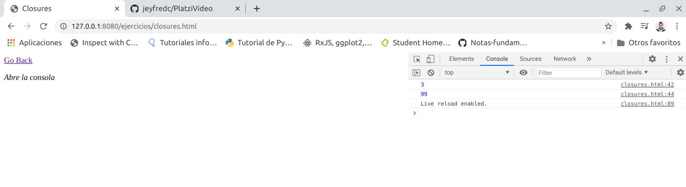

si se quisiera evitar que se acceda a la variable se hace lo siguiente

crear una funcion que recibe como parametro a n que es un numero y se retornan varias funciones pero por si solo no permite acceder ni cambiar la variable por otro numero

```
        <script>
            //Clousures
            //printColor

            //IIFE
            //(function () {
            //    let color = 'green';

            //    function printColor() {
            //        console.log(color);
            //    }

            //    printColor();
            //})();

            // Funciones que regresan funciones

            //function makeColorPrinter(color) {
            //    let colorMessage = `The color is ${color}`;

            //    return function() {
            //        console.log(colorMessage);
            //    };
            //}

            //let redColorPrinter = makeColorPrinter('red');
            //console.log(redColorPrinter());

            // Variables "privadas"
            //const counter = {
            //    count: 3,
            //};

            //console.log(counter.count);

            function makeCounter(n) {
                let count = n;

                return {
                    increase: function () {},
                    decrease: function () {},
                    getCount: function () {},
                };
            }

            let counter = makeCounter(5);

            console.log(counter.count);
            
        </script>
```


pero para acceder a la variable se puede agregar funcionalidad a cada una y acceder a la variable a traves de la funcion asi 

```
        <script>
            //Clousures
            //printColor

            //IIFE
            //(function () {
            //    let color = 'green';

            //    function printColor() {
            //        console.log(color);
            //    }

            //    printColor();
            //})();

            // Funciones que regresan funciones

            //function makeColorPrinter(color) {
            //    let colorMessage = `The color is ${color}`;

            //    return function() {
            //        console.log(colorMessage);
            //    };
            //}

            //let redColorPrinter = makeColorPrinter('red');
            //console.log(redColorPrinter());

            // Variables "privadas"
            //const counter = {
            //    count: 3,
            //};

            //console.log(counter.count);

            function makeCounter(n) {
                let count = n;

                return {
                    increase: function () {},
                    decrease: function () {},
                    getCount: function () {
                        return count;
                    },
                };
            }

            let counter = makeCounter(5);

            console.log(counter.getCount());
            
        </script>
```


completando cada funcion esto es lo que se podria hacer, pero de ninguna forma se podria re asignar la variable como se habia hecho en el ejemplo sin establecer funciones

```
            function makeCounter(n) {
                let count = n;

                return {
                    increase: function () {
                        return count = count +1 ;
                    },
                    decrease: function () {
                        return count = count -1 ;
                    },
                    getCount: function () {
                        return count;
                    },
                };
            }

            let counter = makeCounter(5);

            console.log('The count is ', counter.getCount());
            counter.increase();
            console.log('The count is ', counter.getCount());
            counter.decrease();
            counter.decrease();
            counter.decrease();
            counter.decrease();
            console.log('The count is ', counter.getCount());

            counter.count = 0;
            console.log('The count is ', counter.getCount());
```

La razon de que aparezca dos veces el numero 2 es porque la variable no se dejo re asignar y con `counter.increase()` aumento la primer vez el numero a 6 y luego se ejecuto cuatros veces `counter.decrease();` y por eso la funcion quedo en 2


<div align="right">
  <small><a href="#tabla-de-contenido">🡡 volver al inicio</a></small>
</div>

## El primer plugin

Abrir el archivo **MediaPlayer.js** 

1. se crea la propiedad de plugins para poder acceder a traves de un array `this.plugins = config.plugins || [];`

2. se inicializa el metodo `this.initPlugins();` dentro del constructor que posteriormente se va a crear

```
class MediaPlayer {
    constructor(config){
      this.media = config.movie;
      this.plugins = config.plugins || [];
      this.initPlugins();
    }

    initPlugins(){
      this.plugins.forEach(plugin => {
        plugin.run(this)
      });
    }
    
    play(){
      this.media.play();
    }
    
    pause(){
      this.media.pause();
    }
    
    mute(){
      this.media.muted = true;
    }

    unmute(){
      this.media.muted = false;
    }
    ejec(){
      if(this.media.paused){
        this.play();
      }else{
        this.pause();
    }


  }
}

export default MediaPlayer;
```

3. se crear el metodo initPlugins

```
initPlugins(){
  this.plugins.forEach(plugin => {
    plugin.run(this)
  });
  }

```

4. se crea el metodo muted y unmuted 

```
    mute(){
      this.media.muted = true;
    }

    unmute(){
      this.media.muted = false;
    }
```

5. dentro de la carpeta **assets** del pryecto se crea una subcarpeta llamada **plugins** y dentro de esta se crea el archivo **AutoPlay.js** el cual contiene a la clase `AutoPlay` y el metodo `run()`, el cual ejecuta la instancia de MediaPLayer a traves de player con los metodos mute y play para que cuando el navegador se abra automaticamente empiece a reproducirse sin sonido

```
class AutoPlay {
    run(player){
        player.mute()
        player.play()
    }
}

export default AutoPlay;
```

6. Por ultimo se importa la clase AutoPlay a **index.js** y la instancia queda creada con player que es la misma que utiliza MediaPlayer

```
import MediaPlayer from './MediaPlayer.js'
import AutoPlay from './plugins/AutoPlay.js'

const video = document.querySelector('video');
const button = document.querySelector('button');
const player = new MediaPlayer({ movie : video, plugins : [new AutoPlay()] })

button.onclick = () => player.ejec()
```

por ultimo abrir el navegador y verificar que el video este sin sonido y se reproduzca automaticamente

**Reto:** Añadir un nuevo boton a la interfaz el cual es el boton de **mute**, para que cuando el video comience el usuario pueda dar unmute y pueda escuchar el video

<div align="right">
  <small><a href="#tabla-de-contenido">🡡 volver al inicio</a></small>
</div>

## this

this se refiere a un objeto, ese objeto es el que actualmente está ejecutando un pedazo de código.

No se puede asignar un valor a this directamente y este depende de en que scope nos encontramos:

- Cuando llamamos a this en el **Global Scope** o **Function Scope**, se hace referencia al objeto window. A excepción de cuando estamos en **strict mode** que nos regresará undefined.

- Cuando llamamos a this desde una función que está contenida en un objeto, this se hace referencia a ese objeto.

- Cuando llamamos a this desde una **“clase”**, se hace referencia a la instancia generada por el constructor.

Abrir **index.js** y comentar la instancia de plugins asi para no utilizar el plugin adaptado en la clase anterior que era hacer autoplay al recargar la pagina

```
import MediaPlayer from './MediaPlayer.js'
import AutoPlay from './plugins/AutoPlay.js'

const video = document.querySelector('video');
const button = document.querySelector('button');
const player = new MediaPlayer({ movie : video, //plugins : [new AutoPlay()] 
})

button.onclick = () => player.ejec()
```

Ahora en la carpeta de **ejercicios** crear un nuevo archivo que se llame **this.html** y agregar lo siguiente 

```
<html>
    <head>
        <title>This</title>
    </head>

    <body>
        <a href="/ejercicios/">Go Back</a>
        <p><em>Abre la consola</em></p>

        <h1>
            <code>this</code> se refiere a un objeto. Ese objeto es el que actualmente está ejecutando un pedazo de código</h1>

        <script>
            // this en el scope global
            //this en el scope de una funcion
            // this en el scope de una funcion en strict mode
            // this en el contexto de un objeto
            // this cuando sacamos una funcion de un objeto
            // this en el contexto de una clase
        </script>
    </body>
</html>
```

y en el **index.html** de la carpeta ejercicios añadir la siguiente linea de codiga despues de closures

`<li><a href="/ejercicios/this.html">this</a></li>`

Ahora en el navegador abrir la ruta http://127.0.0.1:8080/ejercicios/ y seleccionar this y abrir la consola 

**this** es un concepto que tienen muchos lenguajes de programacion, sobre todo los que son orientados a objetos.

this se refiere a la instancia de una clase cuando se crea un objeto y generalmente se escribe **this.nombredepropiedad** o **this.nombredemetodo** lo que quiere decir que ese objeto tiene acceso ya sea a una propiedad o a un metodo.

En JavaScript ocurre lo mismo pero tambien hay otros contextos que se deben conocer para saber en que momento this se comporta de una manera u obtiene valores diferentes 

- this en el scope global -> es cuando esta entre etiquetas, no hay ninguna funcion, no hay ningun objeto 

en el archivo **this.html** entre los scripts empezar a colocar 

```
        <script>
            // this en el scope global
            console.log(`this: ${this}`);
            //this en el scope de una funcion
            // this en el scope de una funcion en strict mode
            // this en el contexto de un objeto
            // this cuando sacamos una funcion de un objeto
            // this en el contexto de una clase
        </script>
```


sale que this es un objeto y que ese objeto es window, el navegador cuando this esta en el contexto global siempre lo va a asignar a window

- this en el scope de una funcion

```
        <script>
            // this en el scope global
            console.log(`this: ${this}`);
            //this en el scope de una funcion
            function whoIsThis(){
                return this;
            }

            console.log(`whoIsThis(): ${whoIsThis()}`);
            // this en el scope de una funcion en strict mode
            // this en el contexto de un objeto
            // this cuando sacamos una funcion de un objeto
            // this en el contexto de una clase
        </script>
```


En este caso el motor de JavaScript tambien lo asigna a window porque esta llamando la funcion directamente

- this en el scope de una funcion en strict mode y este se enciende con esta sintaxis `"use strict",`, en este caso se coloca dentro de la funcion

```
        <script>
            // this en el scope global
            console.log(`this: ${this}`);
            //this en el scope de una funcion
            function whoIsThis(){
                return this;
            }

            console.log(`whoIsThis(): ${whoIsThis()}`);
            // this en el scope de una funcion en strict mode
            function whoIsThisStrict(){
                "use strict";
                return this;
            }

            console.log(`whoIsThisSctrict(): ${whoIsThisStrict()}`);
            // this en el contexto de un objeto
            // this cuando sacamos una funcion de un objeto
            // this en el contexto de una clase
        </script>
```


this en `whoIsThisSctrict()` es undefined y es el comportamiento que debe tener al usar el strict mode el cual sirve para evitar errores 

- this en el contexto de un objeto

```
        <script>
            // this en el scope global
            console.log(`this: ${this}`);
            //this en el scope de una funcion
            function whoIsThis(){
                return this;
            }

            console.log(`whoIsThis(): ${whoIsThis()}`);
            // this en el scope de una funcion en strict mode
            function whoIsThisStrict(){
                "use strict";
                return this;
            }

            console.log(`whoIsThisSctrict(): ${whoIsThisStrict()}`);
            // this en el contexto de un objeto
            const person= {
                name: 'Jeyfred',
                saludar(){
                    console.log(`Hola soy ${this.name}`);
                }
            }

            person.saludar();

            // this cuando sacamos una funcion de un objeto
            // this en el contexto de una clase
        </script>
```


En este caso la funcion saludar la esta ejecutando el objeto person y cuando se escribe `{this.name}` se refiere al objeto que se esta ejecutando dentro de si mismo por lo tanto this es todo el objeto person

- this cuando sacamos una funcion de un objeto

```
        <script>
            // this en el scope global
            console.log(`this: ${this}`);
            //this en el scope de una funcion
            function whoIsThis(){
                return this;
            }

            console.log(`whoIsThis(): ${whoIsThis()}`);
            // this en el scope de una funcion en strict mode
            function whoIsThisStrict(){
                "use strict";
                return this;
            }

            console.log(`whoIsThisSctrict(): ${whoIsThisStrict()}`);
            // this en el contexto de un objeto
            const person= {
                name: 'Jeyfred',
                saludar(){
                    console.log(`Hola soy ${this.name}`);
                }
            }

            person.saludar();

            // this cuando sacamos una funcion de un objeto

            const accion = person.saludar;
            accion();
            // this en el contexto de una clase
        </script>
```


Ahora el navegador solo ejecuta **Hola soy** y es porque accion no se esta llamando dentro del contexto de un objeto  si no que se esta llamando directamente y en ese caso `{this.name}` ya no existe 

- this en el contexto de una clase

```
        <script>
            // this en el scope global
            console.log(`this: ${this}`);
            //this en el scope de una funcion
            function whoIsThis(){
                return this;
            }

            console.log(`whoIsThis(): ${whoIsThis()}`);
            // this en el scope de una funcion en strict mode
            function whoIsThisStrict(){
                "use strict";
                return this;
            }

            console.log(`whoIsThisSctrict(): ${whoIsThisStrict()}`);
            // this en el contexto de un objeto
            const person= {
                name: 'Jeyfred',
                saludar(){
                    console.log(`Hola soy ${this.name}`);
                }
            }

            person.saludar();

            // this cuando sacamos una funcion de un objeto

            const accion = person.saludar;
            accion();
            // this en el contexto de una clase
            class Person{
                constructor(name){
                    this.name = name;
                }
                saludar(){
                    console.log(`Me llamo ${this.name}`);
                }
            }

            const carlos = new Person('carlos');

            carlos.saludar();
        </script>
```

En este caso se crea una clase y en el constructor se le pasa el parametro name, al pasar `this.name = name;` significa que al objeto Person se le esta asignando un atributo name que es igual al constructor, despues se crea el metodo `saludar()` y este metodo tiene acceso a al atributo de la clase, posteriormente despues de cerrar la clase se crea un objeto carlos que es de tipo Person que despues a traves del objeto carlos llama al metodo saludar y lo ejecuta. En este caso **this** se refiere a la instancia del objeto el cual es carlos mas no a la clase que es Person

<div align="right">
  <small><a href="#tabla-de-contenido">🡡 volver al inicio</a></small>
</div>

## Los métodos call, apply y bind

Estas funciones nos sirven para establecer el valor de this, es decir cambiar el contexto que se va usar cuando la función sea llamada.

Las funciones **call**, **apply** y **bind** son parte del prototipo Function. Toda función usa este prototipo y por lo tanto tiene estas tres funciones.

- **functionName.call().** Ejecuta la función recibiendo como primer argumento el this y los siguientes son los argumentos que recibe la función que llamó a call.

- **functionName.apply().** Ejecuta la función recibiendo como primer argumento el this y como segundo un arreglo con los argumentos que recibe la función que llamó a apply.

- **functionName.bind().** Recibe como primer y único argumento el this. No ejecuta la función, sólo regresa otra función con el nuevo this integrado.

dentro de la carpeta de **ejercicios** crear un archivo llamado **call-apply-bind.html** con lo siguiente

```
<html>
    <head>
        <title>call-apply-bind</title>
    </head>

    <body>
        <a href="/ejercicios/">Go Back</a>
        <p><em>Abre la consola</em></p>

<!--         <ul>
            <li><button class="call-to-action">Aprender</button></li>
            <li><button class="call-to-action">Aprender Más</button></li>
            <li><button class="call-to-action">¡Nunca parar de Aprender!</button></li>
          </ul> -->
      

        <script>
        // Establece `this` usando `call`
        // Establece `this` usando `call` y pasar argumentos a la función
        // Establece `this` usando `apply` y pasar argumentos a la función

        // Establecer `this` en una nueva función usando `bind`
        // Cuándo es útil usar uno de estos métodos
        </script>
    </body>
</html>
```

y en el **index.html** de la carpeta **ejercicios** añadir la siguiente linea de codiga despues de this

`<li><a href="/ejercicios/call-apply-bind.html">call-apply-bind</a></li>`

Ahora en el navegador abrir la ruta http://127.0.0.1:8080/ejercicios/ y seleccionar call-apply-bind y abrir la consola 

- Establece `this` usando `call`

```
        <script>
        // Establece `this` usando `call`

        function saludar(){
            console.log(`Hola soy ${this.name} ${this.lastname}`);
        }

        const jeyfred = {
            name : 'Jeyfred',
            lastname : 'Calderon',
        }

        saludar.call(jeyfred)

        // Establece `this` usando `call` y pasar argumentos a la función
        // Establece `this` usando `apply` y pasar argumentos a la función

        // Establecer `this` en una nueva función usando `bind`
        // Cuándo es útil usar uno de estos métodos
        </script>
```


1. Se crea la funcion saludar pasando en la funcion un console.log que llama a 2 argunmentos a traves de this

2. se crea un objeto con atributos

3. todas las funciones tienen acceso a los metodos call, apply y bind.

4. El metodo call tiene acceso a this que en este caso this es el objeto jeyfred

- Establece `this` usando `call` y pasar argumentos a la función

Las funciones tambien pueden recibir argumentos para esto se va a crear una nueva funcion caminar, la cual recibe los parametros de metros y direccion y a traves de un `console.log` se imprimen, en este caso se de usar la funcion **caminar.call(this, argumentos)** pasando como primer parametro a this y como segundo parametro los parametros de la funcion caminar

```
        <script>
        // Establece `this` usando `call`

        function saludar(){
            console.log(`Hola soy ${this.name} ${this.lastname}`);
        }

        const jeyfred = {
            name : 'Jeyfred',
            lastname : 'Calderon',
        }

        saludar.call(jeyfred)

        // Establece `this` usando `call` y pasar argumentos a la función
        function caminar(metros, direccion) {
            console.log(`${this.name} camina ${metros} metros hacia el ${direccion}`);
        }

        caminar.call(jeyfred, 400 , 'Sur');

        // Establece `this` usando `apply` y pasar argumentos a la función

        // Establecer `this` en una nueva función usando `bind`
        // Cuándo es útil usar uno de estos métodos
        </script>
```


- Establece `this` usando `apply` y pasar argumentos a la función

```
        <script>
        // Establece `this` usando `call`

        function saludar(){
            console.log(`Hola soy ${this.name} ${this.lastname}`);
        }

        const jeyfred = {
            name : 'Jeyfred',
            lastname : 'Calderon',
        }

        saludar.call(jeyfred)

        // Establece `this` usando `call` y pasar argumentos a la función
        function caminar(metros, direccion) {
            console.log(`${this.name} camina ${metros} metros hacia el ${direccion}`);
        }

        caminar.call(jeyfred, 400 , 'Sur');

        // Establece `this` usando `apply` y pasar argumentos a la función

        caminar.apply(jeyfred, [800, 'noroccidente']);
        // Establecer `this` en una nueva función usando `bind`
        // Cuándo es útil usar uno de estos métodos
        </script>
```


el metodo apply hace lo mismo hace lo mismo que call pero en primer lugar recibe a this y los parametros los recibe por medio de una array `caminar.apply(this, [metros, direccion]);`

Tambien se puede establecer a traves de un array de esta forma

```
        <script>
        // Establece `this` usando `call`

        function saludar(){
            console.log(`Hola soy ${this.name} ${this.lastname}`);
        }

        const jeyfred = {
            name : 'Jeyfred',
            lastname : 'Calderon',
        }

        saludar.call(jeyfred)

        // Establece `this` usando `call` y pasar argumentos a la función
        function caminar(metros, direccion) {
            console.log(`${this.name} camina ${metros} metros hacia el ${direccion}`);
        }

        caminar.call(jeyfred, 400 , 'Sur');

        // Establece `this` usando `apply` y pasar argumentos a la función

        //caminar.apply(jeyfred, [800, 'noroccidente']);

        const valores = [800, 'noroccidente'];

        caminar.apply(jeyfred, valores);

        // Establecer `this` en una nueva función usando `bind`
        // Cuándo es útil usar uno de estos métodos
        </script>
```


Se crea una constante valores que contiene un arrray con los metros y la direccion y se manda a llamar a traves de la constante

- Establecer `this` en una nueva función usando `bind`

```
        <script>
        // Establece `this` usando `call`

        function saludar(){
            console.log(`Hola soy ${this.name} ${this.lastname}`);
        }

        const jeyfred = {
            name : 'Jeyfred',
            lastname : 'Calderon',
        }

        saludar.call(jeyfred)

        // Establece `this` usando `call` y pasar argumentos a la función
        function caminar(metros, direccion) {
            console.log(`${this.name} camina ${metros} metros hacia el ${direccion}`);
        }

        caminar.call(jeyfred, 400 , 'Sur');

        // Establece `this` usando `apply` y pasar argumentos a la función

        //caminar.apply(jeyfred, [800, 'noroccidente']);

        const valores = [800, 'noroccidente'];

        caminar.apply(jeyfred, valores);

        // Establecer `this` en una nueva función usando `bind`
        const camilo = { name: 'Camilo', lastname: 'Reyes'}
        saludar.bind(camilo);
        // Cuándo es útil usar uno de estos métodos
        </script>
```

Al crear una nueva constante con un array en este caso y utilizar el metodo bind el navegador no va a mostrar nada 


y es porque bind fuynciona a traves de una funcion de esta forma se corrige asi 

```
        const camilo = { name: 'Camilo', lastname: 'Reyes'}
        const camiloSaluda = saludar.bind(camilo);

        camiloSaluda();
```

tambien se puede establecer la funcion caminar de la siguiente forma

```
        const camilo = { name: 'Camilo', lastname: 'Reyes'}
        const camiloSaluda = saludar.bind(camilo);

        camiloSaluda();

        const camiloCamina = caminar.bind(camilo);
        camiloCamina(1000, 'este');
```


y la otra forma de guardar los valores 1000 y 'este' es pasandolos a los parametros de la funcion bind

```
        const camilo = { name: 'Camilo', lastname: 'Reyes'}
        const camiloSaluda = saludar.bind(camilo);

        camiloSaluda();

        const camiloCamina = caminar.bind(camilo, 2000, 'este');
        camiloCamina();
```


y la ultima forma de guardar es usando la funcion y los parametros del metodo asi 

```
        const camilo = { name: 'Camilo', lastname: 'Reyes'}
        const camiloSaluda = saludar.bind(camilo);

        camiloSaluda();

        const camiloCamina = caminar.bind(camilo, 3000);
        camiloCamina('oeste');
```


- Cuándo es útil usar uno de estos métodos

Cada uno funciona ligeramente **call** y **apply** van a establecer el **this** y van a llamar la funcion inmediatamente.

**bind** va a crear una nueva funcion donde **this** va a estar guardado pero despues toca guardar esa funcion

Cada uno de los metodos tiene formas diferentes de pasar argumentos en casos de que sea necesario.

Hay veces que existen objetos que se parecen a otros por ejemplo cuando se usa un **getElementByClassName** del **DOM(Document Object Model)** lo que regresa es un objeto de tipo **Node list**, No es un array, por lo tanto no tiene todos los metodos que tiene un array, no hay un **for each**.

Descomentar las etiquetas que estan en el html que estan dentro de la etiqueta `<ul></ul>`, al quedar descomentados ya aparecen en el navegador pero estos no hacen nada 

```
<html>
    <head>
        <title>call-apply-bind</title>
    </head>

    <body>
        <a href="/ejercicios/">Go Back</a>
        <p><em>Abre la consola</em></p>

        <ul>
            <li><button class="call-to-action">Aprender</button></li>
            <li><button class="call-to-action">Aprender Más</button></li>
            <li><button class="call-to-action">¡Nunca parar de Aprender!</button></li>
          </ul>
      

        <script>
        // Establece `this` usando `call`

        function saludar(){
            console.log(`Hola soy ${this.name} ${this.lastname}`);
        }

        const jeyfred = {
            name : 'Jeyfred',
            lastname : 'Calderon',
        }

        saludar.call(jeyfred)

        // Establece `this` usando `call` y pasar argumentos a la función
        function caminar(metros, direccion) {
            console.log(`${this.name} camina ${metros} metros hacia el ${direccion}`);
        }

        caminar.call(jeyfred, 400 , 'Sur');

        // Establece `this` usando `apply` y pasar argumentos a la función

        //caminar.apply(jeyfred, [800, 'noroccidente']);

        const valores = [800, 'noroccidente'];

        caminar.apply(jeyfred, valores);

        // Establecer `this` en una nueva función usando `bind`
        const camilo = { name: 'Camilo', lastname: 'Reyes'}
        const camiloSaluda = saludar.bind(camilo);

        camiloSaluda();

        const camiloCamina = caminar.bind(camilo, 3000);
        camiloCamina('oeste');
        // Cuándo es útil usar uno de estos métodos
        </script>
    </body>
</html>
```


se les quiere dar funcionalidad, dentro de las etiquetas de script añadir lo siguiente

```
        <script>
        // Establece `this` usando `call`

        function saludar(){
            console.log(`Hola soy ${this.name} ${this.lastname}`);
        }

        const jeyfred = {
            name : 'Jeyfred',
            lastname : 'Calderon',
        }

        saludar.call(jeyfred)

        // Establece `this` usando `call` y pasar argumentos a la función
        function caminar(metros, direccion) {
            console.log(`${this.name} camina ${metros} metros hacia el ${direccion}`);
        }

        caminar.call(jeyfred, 400 , 'Sur');

        // Establece `this` usando `apply` y pasar argumentos a la función

        //caminar.apply(jeyfred, [800, 'noroccidente']);

        const valores = [800, 'noroccidente'];

        caminar.apply(jeyfred, valores);

        // Establecer `this` en una nueva función usando `bind`
        const camilo = { name: 'Camilo', lastname: 'Reyes'}
        const camiloSaluda = saludar.bind(camilo);

        camiloSaluda();

        const camiloCamina = caminar.bind(camilo, 3000);
        camiloCamina('oeste');
        // Cuándo es útil usar uno de estos métodos
        const buttons = document.getElementsByClassName("Call-to-action");
        buttons.forEach(button => {
            button.onclick = () => alert("Nunca pares de aprender!")
        })

        </script>
```

Se establecio una constante buttons, que llama a los elementos por la clase y luego los pone a las escucha para que al hacer click sobre ellos salga un mensaje de alerta que diga Nunca pares de aprender pero como este elemento no es un array no va a funcionar en el navegador porque es un NodeList


- NodeList

Los NodeList se parecen a los arrays y tienen una propiedad que se llama lenght y esto es suficiente para saber que se puede arreglar llamando un foreach a traves de un array.

Porque forEach es una propiedad del prototype al cual se le puede cambiar el `this` usando `call` para esto se comenta la funcion anterior y se establece la nueva a traves de un array y en este caso todos los botones van a funcionar

```
        <script>
        // Establece `this` usando `call`

        function saludar(){
            console.log(`Hola soy ${this.name} ${this.lastname}`);
        }

        const jeyfred = {
            name : 'Jeyfred',
            lastname : 'Calderon',
        }

        saludar.call(jeyfred)

        // Establece `this` usando `call` y pasar argumentos a la función
        function caminar(metros, direccion) {
            console.log(`${this.name} camina ${metros} metros hacia el ${direccion}`);
        }

        caminar.call(jeyfred, 400 , 'Sur');

        // Establece `this` usando `apply` y pasar argumentos a la función

        //caminar.apply(jeyfred, [800, 'noroccidente']);

        const valores = [800, 'noroccidente'];

        caminar.apply(jeyfred, valores);

        // Establecer `this` en una nueva función usando `bind`
        const camilo = { name: 'Camilo', lastname: 'Reyes'}
        const camiloSaluda = saludar.bind(camilo);

        camiloSaluda();

        const camiloCamina = caminar.bind(camilo, 3000);
        camiloCamina('oeste');
        // Cuándo es útil usar uno de estos métodos
        const buttons = document.getElementsByClassName("Call-to-action");
        //buttons.forEach(button => {
        //    button.onclick = () => alert("Nunca pares de aprender!")
        //})

        // NodeList

        Array.prototype.forEach.call(buttons, button => {
                button.onclick = () => alert("Nunca pares de aprender!")
            })

        </script>
```

Lo que sucedio es que se llamo la funcion `Array.prototype.forEach`, llamando como contexto a `this` es decir a `buttons` como contexto


<div align="right">
  <small><a href="#tabla-de-contenido">🡡 volver al inicio</a></small>
</div>

## Prototype

En Javascript todo son objetos, en el estandard anterior de JavaScript **ES5(EcmaScript5)** no teniamos clases, ni teniamos ese plano para crear objetos como lo hacian los lenguajes como JAVA.

En este capitulo se va a explicar como funcionaba prototype para tener claridad sobre como se manejaba JavaScript en sus versiones pasadas antes de Junio de 2015.

Todos los objetos “heredan” de un prototipo que a su vez hereda de otro prototipo y así sucesivamente creando lo que se llama la **prototype chain**.

La keyword new crea un nuevo objeto que “hereda” todas las propiedades del prototype de otro objeto. No confundir prototype con proto que es sólo una propiedad en cada instancía que apunta al prototipo del que hereda.

Dentro de la carpeta **ejercicios** crear el archivo **prototype.html** y agregar lo siguiente

```
<html>
    <head>
        <title>Protoype</title>
    </head>

    <body>
        <a href="/ejercicios/">Go Back</a>
        <p><em>Abre la consola</em></p>

        <script>
            // Un objeto común y corriente
            // Otro objeto más
            // Seamos un poco más eficientes
            // Aun podemos mejorar más y evitar tener que crear la misma funcion cada
            // Object.create
            // Los métodos de hero dentro de Hero
            // new es un atajo (azucar sintactica) para llevar Hero.protype al objeto
        </script>
    </body>
</html>
```

y en el **index.html** de la carpeta **ejercicios** añadir la siguiente linea de codiga despues de this

`<li><a href="/ejercicios/prototype.html">prototype</a></li>`

Ahora en el navegador abrir la ruta http://127.0.0.1:8080/ejercicios/, seleccionar prototype y abrir la consola 

- Un objeto común y corriente

```
        <script>
            // Un objeto común y corriente
            const ironMan = {
                name : "Iron Man"
            }

            ironMan.saludar = function () {
                console.log(`Hola soy ${this.name}`)
            }

            ironMan.saludar();
            // Otro objeto más
            // Seamos un poco más eficientes
            // Aun podemos mejorar más y evitar tener que crear la misma funcion cada
            // Object.create
            // Los métodos de hero dentro de Hero
            // new es un atajo (azucar sintactica) para llevar Hero.protype al objeto
        </script>
```

Se crea una constante ironMan que contiene un array con el nombre

Se crea el metodo saludar utilizando el estandard **ES5** a traves de una funcion y se manda a llamar la funcion con el objeto ironMan


- Otro objeto más

```
        <script>
            // Un objeto común y corriente
            const ironMan = {
                name : "Iron Man"
            }

            ironMan.saludar = function () {
                console.log(`Hola soy ${this.name}`)
            }

            ironMan.saludar();
            // Otro objeto más

            const gamora = {
                name : "Gamora"
            }

            gamora.saludar = function () {
                console.log(`Hola soy ${this.name}`)
            }

            gamora.saludar();

            // Seamos un poco más eficientes
            // Aun podemos mejorar más y evitar tener que crear la misma funcion cada
            // Object.create
            // Los métodos de hero dentro de Hero
            // new es un atajo (azucar sintactica) para llevar Hero.protype al objeto
        </script>
```


Esto es ineficiente porque se esta repitiendo codigo

- Seamos un poco más eficientes
```
        <script>
            // Un objeto común y corriente
            //const ironMan = {
            //    name : "Iron Man"
            //}

            //ironMan.saludar = function () {
            //    console.log(`Hola soy ${this.name}`)
            //}

            //ironMan.saludar();
            //// Otro objeto más

            //const gamora = {
            //    name : "Gamora"
            //}

            //gamora.saludar = function () {
            //    console.log(`Hola soy ${this.name}`)
            //}

            //gamora.saludar();

            // Seamos un poco más eficientes

            function Hero (name) {
                const hero = {
                    name : name
                }

                hero.saludar = function () {
                    console.log(`Hola soy ${this.name}`)
                };

                return hero
            }

            const ironMan= Hero('Iron Man')
            ironMan.saludar();

            const gamora = Hero('Gamora')
            gamora.saludar();

            // Aun podemos mejorar más y evitar tener que crear la misma funcion cada
            // Object.create
            // Los métodos de hero dentro de Hero
            // new es un atajo (azucar sintactica) para llevar Hero.protype al objeto
        </script>
```

En este caso se creo una funcion que recibe como parametro a name, dentro de esta funcion se crea la constante hero que hace a name igual al name de la funcion y luego se crea al metodo saludar utilizando la constante hero y utilizando el nombre que se pasa por funcion.

Despues se retorna al objeto a hero

por ultimo se pueden crear varios objetos de utilizando la funcion Hero y llamando los metodos


pero todavia se puede optimizar codigo para no llamar constantemente a la funcion saludar

- Aun podemos mejorar más y evitar tener que crear la misma funcion cada

```        <script>
            // Un objeto común y corriente
            //const ironMan = {
            //    name : "Iron Man"
            //}

            //ironMan.saludar = function () {
            //    console.log(`Hola soy ${this.name}`)
            //}

            //ironMan.saludar();
            //// Otro objeto más

            //const gamora = {
            //    name : "Gamora"
            //}

            //gamora.saludar = function () {
            //    console.log(`Hola soy ${this.name}`)
            //}

            //gamora.saludar();

            // Seamos un poco más eficientes

            //function Hero (name) {
            //    const hero = {
            //        name : name
            //    }

            //    hero.saludar = function () {
            //        console.log(`Hola soy ${this.name}`)
            //    };

            //    return hero
            //}

            //const ironMan= Hero('Iron Man')
            //ironMan.saludar();

            //const gamora = Hero('Gamora')
            //gamora.saludar();

            // Aun podemos mejorar más y evitar tener que crear la misma funcion cada

            const heroMethods = {                
                saludar : function () {
                    console.log(`Me llamo ${this.name}`)
                },
            };

            function Hero (name) {
                const hero = {
                    name : name
                };

            hero.saludar = heroMethods.saludar;
            return hero
            }

            const ironMan= Hero('Iron Man')
            ironMan.saludar();

            const gamora = Hero('Gamora')
            gamora.saludar();

            // Object.create
            // Los métodos de hero dentro de Hero
            // new es un atajo (azucar sintactica) para llevar Hero.protype al objeto
        </script>
```

Ahora lo que se hizo fue crear una constante que recibe un array que establece por dentro una funcion pero esto sigue sin ser tan eficiente sin embargo sirve y se sigue ejecutando en el navegador 


- Object.create

Este metodo recibe un objeto y lo que hace es crear un nuevo objeto y el nuevoObjeto tiene todas las propiedades que el objeto que esta dentro del parametro create tiene definido

```
        <script>
            // Un objeto común y corriente
            //const ironMan = {
            //    name : "Iron Man"
            //}

            //ironMan.saludar = function () {
            //    console.log(`Hola soy ${this.name}`)
            //}

            //ironMan.saludar();
            //// Otro objeto más

            //const gamora = {
            //    name : "Gamora"
            //}

            //gamora.saludar = function () {
            //    console.log(`Hola soy ${this.name}`)
            //}

            //gamora.saludar();

            // Seamos un poco más eficientes

            //function Hero (name) {
            //    const hero = {
            //        name : name
            //    }

            //    hero.saludar = function () {
            //        console.log(`Hola soy ${this.name}`)
            //    };

            //    return hero
            //}

            //const ironMan= Hero('Iron Man')
            //ironMan.saludar();

            //const gamora = Hero('Gamora')
            //gamora.saludar();

            // Aun podemos mejorar más y evitar tener que crear la misma funcion cada

            //const heroMethods = {                
            //    saludar : function () {
            //        console.log(`Me llamo ${this.name}`)
            //    },
            //};
//
            //function Hero (name) {
            //    const hero = {
            //        name : name
            //    };
//
            //hero.saludar = heroMethods.saludar;
            //return hero
            //}
//
            //const ironMan= Hero('Iron Man')
            //ironMan.saludar();
//
            //const gamora = Hero('Gamora')
            //gamora.saludar();

            // Object.create

            // const nuevoObjeto = Object.create(objeto)

            const heroMethods = {                
                saludar : function () {
                    console.log(`Soy superheroe! ${this.name}`)
                },
            };

            function Hero (name) {
                const hero = Object.create(heroMethods)
                hero.name = name;
            return hero
            }

            const ironMan= Hero('Iron Man')
            ironMan.saludar();

            const gamora = Hero('Gamora')
            gamora.saludar();
            // Los métodos de hero dentro de Hero
            // new es un atajo (azucar sintactica) para llevar Hero.protype al objeto
        </script>
```

Haciendo referencia a la explicacion de Object.create en este ejemplo la constante hero esta tomando todas las propriedades de `heroMethods`

 

**¿Que es lo que esta haciendo Object.Create?**

Este no solo esta copiando las propiedades de un objeto, para esto se va hacer uso de la consola del navegador.

Aqui hay acceso a una variable global que ironMan y a heroMethods

 

Ahora se va a crear un nuevo hero con una constante para ver que esta sucediendo y al llamarlo en la consola parece estar vacio solo aparece esto `{}` pero al despegarlo aparece `__proto__: Object`, esto quiere decir que tiene herencia prototipal la cual se vera en el siguiente capitulo, el objeto newHero esta adquiriendo las propiedades de heroMethods 

 

- Los métodos de hero dentro de Hero

```
        <script>
            // Un objeto común y corriente
            //const ironMan = {
            //    name : "Iron Man"
            //}

            //ironMan.saludar = function () {
            //    console.log(`Hola soy ${this.name}`)
            //}

            //ironMan.saludar();
            //// Otro objeto más

            //const gamora = {
            //    name : "Gamora"
            //}

            //gamora.saludar = function () {
            //    console.log(`Hola soy ${this.name}`)
            //}

            //gamora.saludar();

            // Seamos un poco más eficientes

            //function Hero (name) {
            //    const hero = {
            //        name : name
            //    }

            //    hero.saludar = function () {
            //        console.log(`Hola soy ${this.name}`)
            //    };

            //    return hero
            //}

            //const ironMan= Hero('Iron Man')
            //ironMan.saludar();

            //const gamora = Hero('Gamora')
            //gamora.saludar();

            // Aun podemos mejorar más y evitar tener que crear la misma funcion cada

            //const heroMethods = {                
            //    saludar : function () {
            //        console.log(`Me llamo ${this.name}`)
            //    },
            //};

            //function Hero (name) {
            //    const hero = {
            //        name : name
            //    };

            //hero.saludar = heroMethods.saludar;
            //return hero
            //}

            //const ironMan= Hero('Iron Man')
            //ironMan.saludar();

            //const gamora = Hero('Gamora')
            //gamora.saludar();

            // Object.create

            // const nuevoObjeto = Object.create(objeto)

            //const heroMethods = {                
            //    saludar : function () {
            //        console.log(`Soy superheroe! ${this.name}`)
            //    },
            //};

            //function Hero (name) {
            //    const hero = Object.create(heroMethods)
            //    hero.name = name;
            //return hero
            //}

            //const ironMan= Hero('Iron Man')
            //ironMan.saludar();

            //const gamora = Hero('Gamora')
            //gamora.saludar();
            // Los métodos de hero dentro de Hero

            function Hero (name) {
                const hero = Object.create(Hero.prototype);
                hero.name = name;
            return hero
            }

            Hero.prototype.saludar = function () {
                console.log(`Soy superpoderoso(a)! ${this.name}`);
            }

            const ironMan= Hero('Iron Man')
            ironMan.saludar();

            const gamora = Hero('Gamora')
            gamora.saludar();

            // new es un atajo (azucar sintactica) para llevar Hero.protype al objeto
        </script>
```

 

Aqui se reduce mas el codigo y utiliza al Hero.prototype para crear el metodo y pasarlo dentro del parametro de la misma funcion

- new es un atajo (azucar sintactica) para llevar Hero.protype al objeto

```
        <script>
            // Un objeto común y corriente
            //const ironMan = {
            //    name : "Iron Man"
            //}

            //ironMan.saludar = function () {
            //    console.log(`Hola soy ${this.name}`)
            //}

            //ironMan.saludar();
            //// Otro objeto más

            //const gamora = {
            //    name : "Gamora"
            //}

            //gamora.saludar = function () {
            //    console.log(`Hola soy ${this.name}`)
            //}

            //gamora.saludar();

            // Seamos un poco más eficientes

            //function Hero (name) {
            //    const hero = {
            //        name : name
            //    }

            //    hero.saludar = function () {
            //        console.log(`Hola soy ${this.name}`)
            //    };

            //    return hero
            //}

            //const ironMan= Hero('Iron Man')
            //ironMan.saludar();

            //const gamora = Hero('Gamora')
            //gamora.saludar();

            // Aun podemos mejorar más y evitar tener que crear la misma funcion cada

            //const heroMethods = {                
            //    saludar : function () {
            //        console.log(`Me llamo ${this.name}`)
            //    },
            //};

            //function Hero (name) {
            //    const hero = {
            //        name : name
            //    };

            //hero.saludar = heroMethods.saludar;
            //return hero
            //}

            //const ironMan= Hero('Iron Man')
            //ironMan.saludar();

            //const gamora = Hero('Gamora')
            //gamora.saludar();

            // Object.create

            // const nuevoObjeto = Object.create(objeto)

            //const heroMethods = {                
            //    saludar : function () {
            //        console.log(`Soy superheroe! ${this.name}`)
            //    },
            //};

            //function Hero (name) {
            //    const hero = Object.create(heroMethods)
            //    hero.name = name;
            //return hero
            //}

            //const ironMan= Hero('Iron Man')
            //ironMan.saludar();

            //const gamora = Hero('Gamora')
            //gamora.saludar();
            // Los métodos de hero dentro de Hero

            //function Hero (name) {
            //    const hero = Object.create(Hero.prototype);
            //    hero.name = name;
            //return hero
            //}

            //Hero.prototype.saludar = function () {
            //    console.log(`Soy superpoderoso(a)! ${this.name}`);
            //}

            //const ironMan= Hero('Iron Man')
            //ironMan.saludar();

            //const gamora = Hero('Gamora')
            //gamora.saludar();

            // new es un atajo (azucar sintactica) para llevar Hero.protype al objeto

            function Hero (name) {
                //const hero = Object.create(Hero.prototype);
                this.name = name;
                //return this
            }

            Hero.prototype.saludar = function () {
                console.log(`New: ${this.name}`);
            }

            const ironMan= new Hero('Iron Man')
            ironMan.saludar();

            const gamora =  new Hero('Gamora')
            gamora.saludar();
        </script>
```

Al utilizar la palabra new lo que esta haciendo es reemplazar esta linea de codigo `const hero = Object.create(Hero.prototype);` y esta sintaxis lo que hace es crear al prototipo de la clase, es decir la instancia de la clase declarada con una constante ironMan o gamora y lo que esta diciendo es que esos 2 objetos van a heredar todas las propiedades y metodos que contengan la clase Hero

 

Actualmente para hacer lo que se hizo en el ultimo ejemplo se utiliza la palabra reservada **Class** para crear instancias de un objeto, para encontrar mas informacion sobre clases y POO(Programacion orienta a objetos) puede visitar el siguiente [link](https://github.com/jeyfredc/Programacion-orientada-a-objetos-POO-#tabla-de-contenido)

<div align="right">
  <small><a href="#tabla-de-contenido">🡡 volver al inicio</a></small>
</div>

## Herencia Prototipal

Por default los objetos en JavaScript tienen cómo prototipo a **Object** que es el punto de partida de todos los objetos, es el prototipo padre. Object es la raíz de todo, por lo tanto tiene un prototipo padre undefined.

Cuando se llama a una función o variable que no se encuentra en el mismo objeto que la llamó, se busca en toda la prototype chain hasta encontrarla o regresar undefined.

La función **hasOwnProperty** sirve para verificar si una propiedad es parte del objeto o si viene heredada desde su prototype chain.

Dentro de la carpeta **ejercicios** crear el archivo **prototypal-inheritance.html** y agregar lo siguiente

```
<html>
    <head>
        <title>prototypal-inheritance</title>
    </head>

    <body>
        <a href="/ejercicios/">Go Back</a>
        <p><em>Abre la consola</em></p>

            <h1>
                <code>SomeObject.prototype</code> es un objeto donde definimos el
                prototipo de las instancias de <code>SomeObject</code>. Es decir, las
                instancias de <code>SomeObject</code> van a "heredar" de
                <code>SomeObject.prototype</code>.
                <br />
                <br />
                <code>SomeObject.[[Prototype]]</code> es el prototipo de
                <code>SomeObject</code>. Es decir, <code>SomeObject</code> "hereda" de
                <code>SomeObject.prototype</code>.
            </h1>

        <script>

            function Hero (name) {
                //const hero = Object.create(Hero.prototype);
                this.name = name;
                //return this
            }

            Hero.prototype.saludar = function () {
                console.log(`Hola, soy ${this.name}`);
            }

            const ironMan= new Hero('Iron Man');

            // propiedades de la instancia
            // propiedades de la ca clase
            // propiedades heredadas ej: toString
            // hasOwnProperty (de donde sale toString o esto?)
        </script>
    </body>
</html>
```

y en el **index.html** de la carpeta **ejercicios** añadir la siguiente linea de codiga despues de this

`<li><a href="/ejercicios/prototypal-inheritance.html">prototypal-inheritance</a></li>`

Ahora en el navegador abrir la ruta http://127.0.0.1:8080/ejercicios/, seleccionar prototypal-inheritance y abrir la consola 

Actualmente el archivo contiene la misma clase Hero que se habia creado en el capitulo anterior y a continuacion se va a ver lo siguiente:

- propiedades de la instancia

```
        <script>

            function Hero (name) {
                //const hero = Object.create(Hero.prototype);
                this.name = name;
                //return this
            }

            Hero.prototype.saludar = function () {
                console.log(`Hola, soy ${this.name}`);
            }

            const ironMan= new Hero('Iron Man');

            // propiedades de la instancia
            console.log(`Name: ${ironMan.name}`);
            // propiedades de la clase
            // propiedades heredadas ej: toString
            // hasOwnProperty (de donde sale toString o esto?)
        </script>
```

 

En este caso el objeto ironMan tiene la propiedad `name`

- propiedades de la clase

```
        <script>

            function Hero (name) {
                //const hero = Object.create(Hero.prototype);
                this.name = name;
                //return this
            }

            Hero.prototype.saludar = function () {
                console.log(`Hola, soy ${this.name}`);
            }

            const ironMan= new Hero('Iron Man');

            // propiedades de la instancia
            console.log(`Name: ${ironMan.name}`);
            // propiedades de la clase

            console.log(`saludar: ${ironMan.saludar}`);

            // propiedades heredadas ej: toString
            // hasOwnProperty (de donde sale toString o esto?)
        </script>
```
En este caso no se ejecuta el metodo saludar, solo se referencia para ver que arroja la consola que indica que es una funcion 

 

- propiedades heredadas ej: toString
```
        <script>

            function Hero (name) {
                //const hero = Object.create(Hero.prototype);
                this.name = name;
                //return this
            }

            Hero.prototype.saludar = function () {
                console.log(`Hola, soy ${this.name}`);
            }

            const ironMan= new Hero('Iron Man');

            // propiedades de la instancia
            console.log(`Name: ${ironMan.name}`);
            // propiedades de la clase

            console.log(`saludar: ${ironMan.saludar}`);

            // propiedades heredadas ej: toString

            console.log(`ToString: ${ironMan.toString}`);

            // hasOwnProperty (de donde sale toString o esto?)
        </script>
```

 

Estas son propiedades que se heredan desde Object y tambien esta definido, no es algo que venga de Hero o algo que se escriba, es algo que simplemente esta 

- hasOwnProperty (de donde sale toString o esto?)

```
        <script>

            function Hero (name) {
                //const hero = Object.create(Hero.prototype);
                this.name = name;
                //return this
            }

            Hero.prototype.saludar = function () {
                console.log(`Hola, soy ${this.name}`);
            }

            const ironMan= new Hero('Iron Man');

            // propiedades de la instancia
            console.log(`Name: ${ironMan.name}`);
            // propiedades de la clase

            console.log(`saludar: ${ironMan.saludar}`);

            // propiedades heredadas ej: toString

            console.log(`ToString: ${ironMan.toString}`);

            // hasOwnProperty (de donde sale toString o esto?)

            console.log(`ironMan.hasOwnProperty("name"): ${ironMan.hasOwnProperty("name")}`);

        </script>
```

 

Como se llega desde la instancia hasta toString, el metodo hasOwnProperty sirve para inspeccionar si algo le pertence directamente a un objeto o si lo toma prestado a traves de herencia 

aqui muestra que al hacer un `console.log(`ironMan.hasOwnProperty("name"): ${ironMan.hasOwnProperty("name")}`);` el navegador muestra que es **true** y ahora si se escribe

`console.log(`ironMan.hasOwnProperty("saludar"): ${ironMan.hasOwnProperty("saludar")}`);`

 

sale que es **false**, es decir que saludar ya no le pertece al objeto **iroMan**, lo tomo prestado 

A continuacion se hace uso de la consola para inspeccionar al objeto **ironMan**

- Lo primero que dice es que **ironMan** proviene de `Hero` y dentro hay algo que dice `__proto__`

 

- Si se inspecciona `__proto__` esta saludar que es la funcion que proviene de Hero, pero sin embargo hay un `__proto__`

 

- Se inspecciona el otro `__proto__`, que viene desde `Object()` y en este esta `hasOwnProperty` y `toString`


- Que significa el primer `__proto__`, este fumciona cuando se llama al objeto es decir `ironMan.__proto__`, pero este puede variar y no es algo que este especificado en el lenguaje, es un detalle de implementacion que ponen los navegadores, Node o cualquier otro entorno 


- La forma correcta o sugerida es usar `Object.getPrototypeOf` y luego pasar el objeto por parametro para que regrese el prototipo


- Aqui se compara al prototipo del objeto ironMan con la clase Hero y sale **true** pero es porque ese objeto es identico al que esta en `prototypeOfIronMan`, pero esto no quiere decir que solo tenga el mismo contenido si no que es el mismo objeto


- Si prototypeOfIronMan es identico a Hero.prototype, se deberia poder crear una funcion y que el objeto obtenga el mismo metodo. Pero esto es una referencia desde ironMan hasta prototype. El lengunaje lo esta encadenando


- si se usa hasOwnProperty("fight"), fight no le pertenece a ironMan


Lo que esta haciendo el lenguaje internamente es preguntar `ironMan.fight` existe?. Este responde no, no existe. Entonces lo que hace es buscar en su `__proto__` y pregunta `ironMan.__proto__.fight` existe?. Este responde si, si existe.

<div align="right">
  <small><a href="#tabla-de-contenido">🡡 volver al inicio</a></small>
</div>

## Parsers y el Abstract Syntax Tree (Analizador y arbol de sintaxis abstracta)

Cuando llega un script al navegador comienza un proceso ejecutado por el motor de javaScript que agarra el codigo, lo analiza, lo deconstruye, lo construye, lo ejecuta y luego lo optimiza

Netscape inicio con JavaScript en ese entonces se realizaban cosas simples a nivel de codigo donde el programa se iba ejecutando linea por linea y se iba interpretando un paso a la vez y actualmente pasa asi pero de forma mas rapida y optimizada la cual llego con google chrome y el motor de JavaScript, esto es lo que hace.

El JS Engine recibe el código fuente y lo procesa de la siguiente manera:

- El **parser** descompone y crea tokens que integran el **AST(Abstract Syntax Tree)**.

- Se compila a **bytecode** y se ejecuta.

- Lo que se pueda se **optimiza a machine code** y se reemplaza el código base.


Javascript pasa a parser donde se obtiene el AST, este lo pasa hacia el interpretador y produce bytecode que es donde empieza a ejecutar el programa, bytecode es un lenguaje de menor nivel y permite que los procesos se ejecuten mas rapido, mientras se ejecuta hay un proceso que se esta ejecutando que es el Profiling data el cual va a estar analizando la ejecucion y encuentras los puntos donde el programa se puede optimizar y eventualmente va a producir el machine code el cual lo hace el Optimizing compiler (Compilador de optimizaciones)

Un parser agarra el codigo fuente y lo va a leer, pero no lo entiende en la forma que se escribe al estar realizando un programa, primero lo debe descomponer y empieza a generar tokens el cual hace ese proceso de descomposicion e identifica que sintaxis como **let**, **new**, simbolos, etc, son palabras claves del lenguaje.

El parser es del 15% al 20% del proceso de ejecución por lo que hay que usar parser del código justo en el momento que lo necesitamos y no antes de saber si se va a usar o no, cuando este detecta un error en la ejecucion del codigo sale un SyntaxError.

Un **SyntaxError** es lanzado cuando el motor JavaScript encuentra partes que no forman parte de la sintaxis del lenguaje y esto lo logra gracias a que se tiene un AST generado por el parser.

Existen dos formas de hacer parsing


para ver un ejemplo de los tokens puede ingresar al siguiente [enlace](https://esprima.org/demo/parse.html#) y hacer click sobre la pestaña **Tokens**

En la parte derecha se observar que let es un keyword o una palabra del lenguaje

Foo es un identificador

= es un puntuador o simbolo de puntuacion

bar es un String

; es otro puntuador o simbolo de puntuacion


Lo mismo va a pasar si se cambia por numeros, van a existir identificadores que denoten que es lo que esta escrito en el lenguaje JavaScript


Luego tambien esta el Abstract Syntax Tree en cual es un grafo (estructura de datos) que representa un programa y que es usado en:

- JavaScript Engine

- Bundlers: Webpack, Rollup, Parcel

- Transpilers: Babel

- Linters: ESLint, Prettify

- Type Checkers: TypeScript, Flow

- Syntax Highlighters

Para ver un ejemplo puede ingresar al siguiente [enlace](https://astexplorer.net/) continuando con el ejemplo de la variable `foo`

Lo cual dice que la raiz de todo es el programa luego en el cuerpo se encuentra que hay una declaracion y en esa declaracion que es de tipo `let`, se encuentra un declarador que tiene un identificador que se llama `foo`


y si se consulta mas alla se van a encontrar mas cosas que tienen que ver con el AST

<div align="right">
  <small><a href="#tabla-de-contenido">🡡 volver al inicio</a></small>
</div>

## Abstract Syntax Tree en Práctica

Se puede usar AST para crear una regla para **ESLint**, la cual es la herramienta que se analiza el codigo tratando de buscar errores y avisando al usuario que parte de la sintaxis esta escribiendo mal, **ESLint** tiene muchas reglas que permiten avisar al usuario que es lo que debe corregir pero ademas de esto tambien se pueden crear nuevas reglas

Dirigir al siguiente [enlace](https://astexplorer.net/#) 

Para poder usar se debe revisar que el explorador debe estar configurado en **babel-eslint**


Donde dice **Transform** verificar que este en **ESLint v4**


En el recuadro inferior izquierdo de la pantalla aparece **Prettier** donde se escribe la regla y en la parte derecha se ve como esta funcionando esa regla.

El codigo que se va a trabajar sobre el recuadro superior izquierdo es una constante y debajo en comentarios van a estar las reglas que se van a crear 

```
const pi = 3.1415;

// Variables constantes
// Variables que guarden un numero

// El nombre de la variable tiene que estar en UPPERCASE
```

Para esto se debe limpiar la consola en la parte de abajo y solo dejar esta parte de codigo

```
export default function(context) {
  return {
  };
};
```

En la parte del arbol aparece como trabaja la variable const, la cual indica que es una variable de declaracion 


en la parte de abajo se coloca que va a recibir una variable de declaracion a la cual se le va a pasar un nodo 

```
export default function(context) {
  return {
    VariableDeclaration(node){
      console.log(node)
  };
};
```

para inspeccionar que es lo que tiene el nodo se hace un `console.log` y se mira en el navegador


En este aparece que el nodo tiene una propiedad llamada `"kind"` que es la constante y si se observa sobre el arbol en body tambien aparece `"kind"`


Ahora se empieza a construir la regla, se quita el `console.log` lo primero que se debe hacer es una validacion donde el nodo y su propiedad deben ser exactamende igual a una constante `if (node.kind === "const")` entonces como `variableDeclarator` es un arreglo se escribe que la constante de `declaration` solo va a tomar en cuenta al primer valor del arreglo `const declaration = node.declarations[0];` 

```
export default function(context) {
  return {
    VariableDeclaration(node){
      //tipo de variable const
      if (node.kind === "const"){
          const declaration = node.declarations[0];
        }
      }
  };
};
```

Despues de asegurar que se obtiene el primer valor se debe asegurar que el valor va a ser numerico, para eso se crea otra validacion, pero primero se de ingresar al arbol en `declarations -> VariableDeclarator -> init -> value` y con un typeof ver de que asegurar que la declaracion sea numerica


```
export default function(context) {
  return {
    VariableDeclaration(node){
      //tipo de variable const
      if (node.kind === "const"){
          const declaration = node.declarations[0];
        
        // asegurarnos que el valor es un numero
        if(typeof declaration.init.value === "number"){
          
        	}
        }
      }
  };
};
```
Despues se debe asegurar que la palabra que se escriba despues de `const` debe estar en mayusculas, para esto se revisa en el arbol e ingresar a `declarations -> VariableDeclarator -> Identifier -> name` y se crea la validacion indicando que si la declaracion no es igual a la misma declaracion pero en mayuscula entonces lance un error


```
export default function(context) {
  return {
    VariableDeclaration(node){
      //tipo de variable const
      if (node.kind === "const"){
          const declaration = node.declarations[0];
        
        // asegurarnos que el valor es un numero
        if(typeof declaration.init.value === "number"){
          if(declaration.id.name != declaration.id.name.toUpperCase()){
            context.report({
              node: declaration.id,
              message: "El nombre de la constante debe estar en mayúsculas"
            		})
          		}
        	}
        }
      }
  };
};
```
Despues de generar el error en la parte inferior derecha aparece el error indicado 


pero si `pi` se cambia por `PI` ahora no aparece el error


Lo importante de usar AST es que tambien deja corregir automaticamente el error para eso se debe agregar una funcion de la siguiente forma donde se pasa que el argumento para reemplazar texto, busca la declaracion en el id y el nombre lo transforma a mayuscula

```
export default function(context) {
  return {
    VariableDeclaration(node){
      //tipo de variable const
      if (node.kind === "const"){
          const declaration = node.declarations[0];
        
        // asegurarnos que el valor es un numero
        if(typeof declaration.init.value === "number"){
          if(declaration.id.name != declaration.id.name.toUpperCase()){
            context.report({
              node: declaration.id,
              message: "El nombre de la constante debe estar en mayúsculas",
              fix: function(fixer){
              	return fixer.replaceText(declaration.id, declaration.id.name.toUpperCase())
            			}
            		})
          		}
        	}
        }
      }
  };
```


En la parte superior izquierda esta en nombre en minuscula y en la parte inferior derecha aparece como se debe colocar, para verlo se agrega otra variable en minusculas donde se observa la transformacion en la otra pantalla a mayusculas


<div align="right">
  <small><a href="#tabla-de-contenido">🡡 volver al inicio</a></small>
</div>

## Cómo funciona el JavaScript Engine

Despues de que el **parser** hizo su trabajo y dio el AST continua el interpretador, el compilador para tener codigo optimizado

Una vez tenemos el **AST** ahora hay que convertirlo a Bytecode.

**Bytecode** es como el código assembler pero en lugar de operar en el procesador opera en la máquina virtual **V8** del navegador.

**Machine code** es el más bajo nivel, es código binario que va directo al procesador.

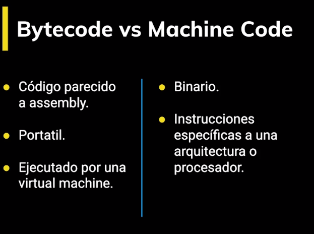

**El profiler** se sitúa en medio del bytecode y el optimizador

Cada máquina virtual tiene sus particularidades, por ejemplo V8 tiene algo llamado Hot Functions.

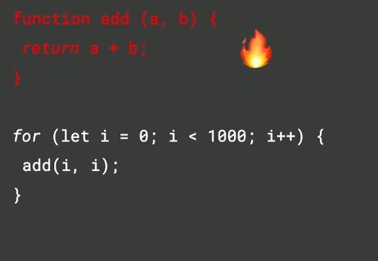

Cuando la funcion ya esta en colocor rojo es cuando esta lista para ser optimizada y es a lo que se le conoce como Hot Functions.

Cuando una sentencia función es ejecutada muy frecuentemente, V8 la denomina como una hot function y hace una optimización que consiste en convertirla a machine code para no tener que interpretarla de nuevo y agilizar su ejecución.

Cada navegador tiene su implementación de JavaScript Engine:

- SpiderMonkey - Firefox

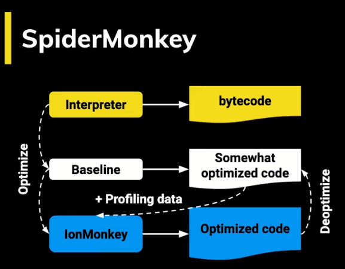

- Chackra - Edge


- JavaScriptCore - Safari

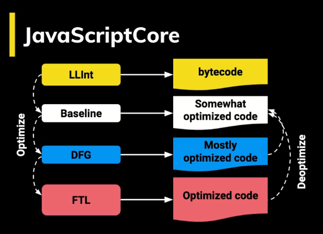

- V8 - Chrome

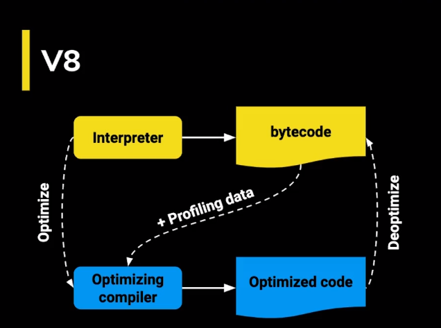

## Event Loop

El **Event Loop** hace que Javascript parezca ser multihilo a pesar de que corre en un solo proceso.

Javascript se organiza usando las siguientes estructuras de datos:

- **Stack**. Va apilando de forma organizada las diferentes instrucciones que se llaman. Lleva así un rastro de dónde está el programa, en que punto de ejecución nos encontramos, primero inicia haciendo push y agregando funciones, pero la unica forma de empezar a sacar o ejecutarlas es haciendo pop como se ve en el grafico a continuacion

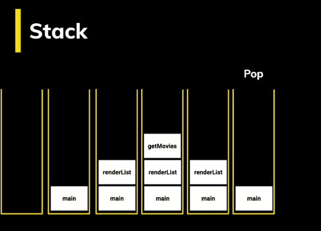

Esta es la forma en como trabaja el stack con el siguiente ejemplo de codigo 

Lo primero que se tiene es un codigo aqui se llama **(anonymous)** porque el programa no tiene nombre

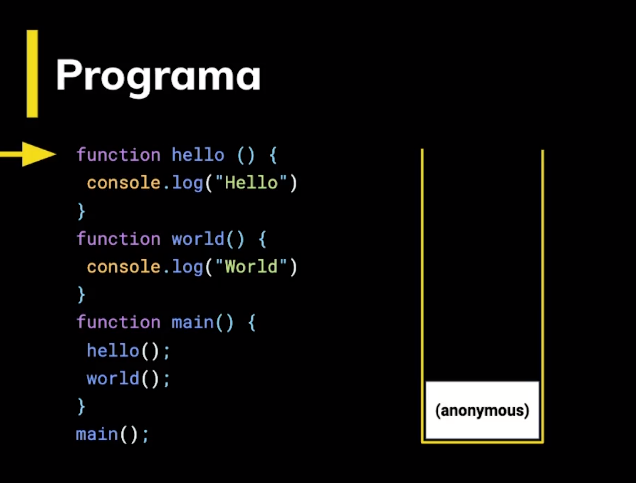

Cuando el programa llega a main se agrega un nivel mas y luego empieza a revisar el codigo nuevamente

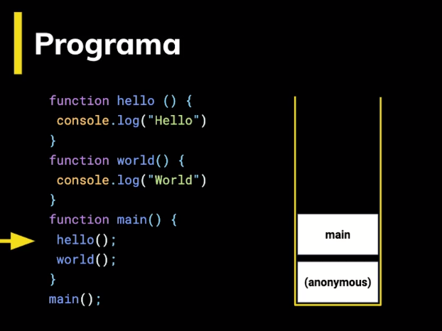

Lo primero que encuentra es la funcion **hello**

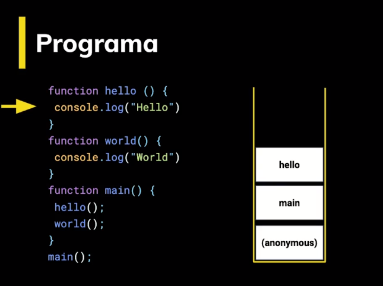

y por ultimo la ejecuta a traves de un **console.log**

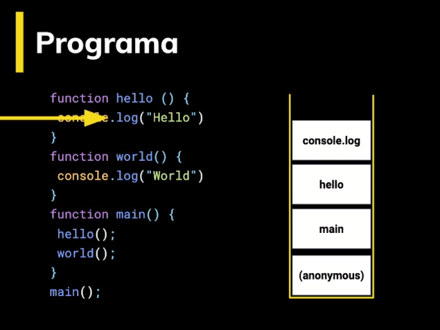

despues que ejecuta **hello** continua leyendo el codigo y se encuentra ahora con la funcion **world** esto va a ocurrir de manera muy rapida

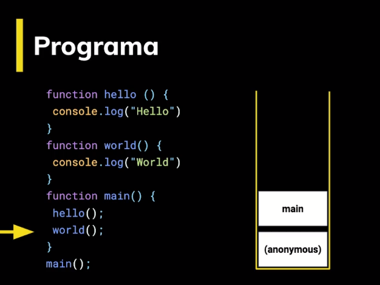

y luego ocurre el mismo proceso que hizo con la funcion **hello**

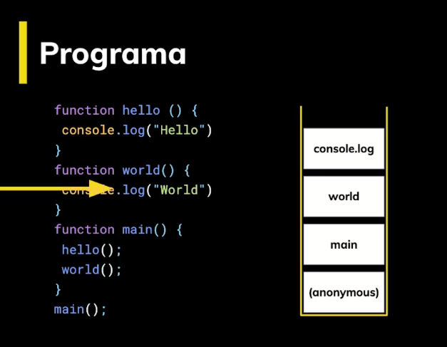

Luego el programa empieza a retroceder, no encuentra nada mas por hacer y el stack queda vacio

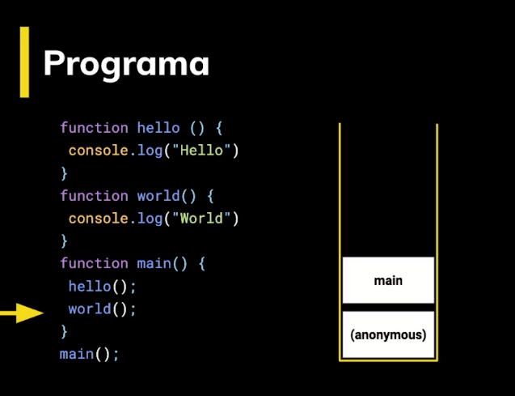

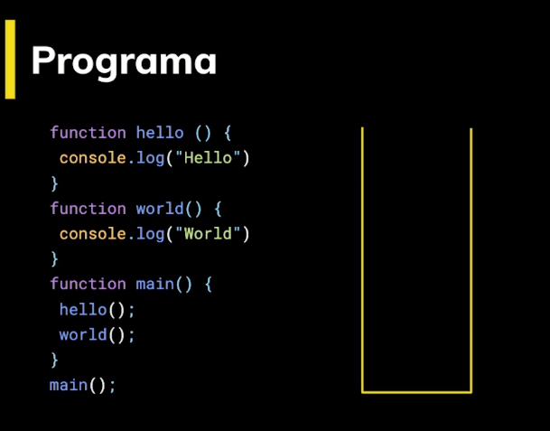

Con un programa asincrono se tiene la funcion pero lo primero que se va a ejecutar es la palabra world y despues hello, recordando que la funcion setTimeOut, recibe una funcion y la ejecuta despues del tiempo que se indique

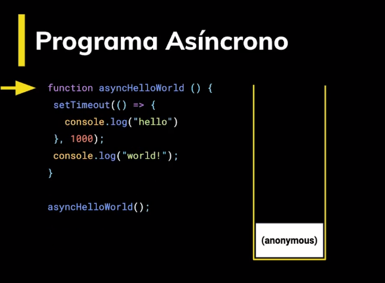

Primero recibe la funcion **asyncHellorWorld**

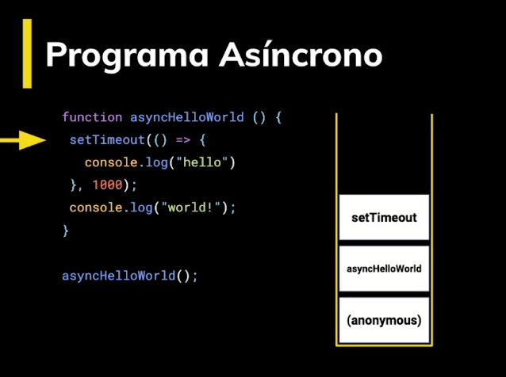

Al haber reconocido setTimeOut lo que hace el programa es continuar con su ejecucion y hacer el console.log de world, a esto se le llama sincronia, hay cosas que van a pasar eventualmente pero primero le toca la impresion a la palabra world

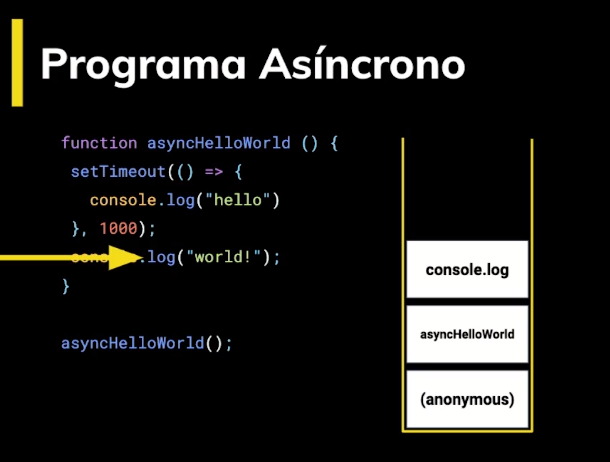

Ahora el programa acaba 

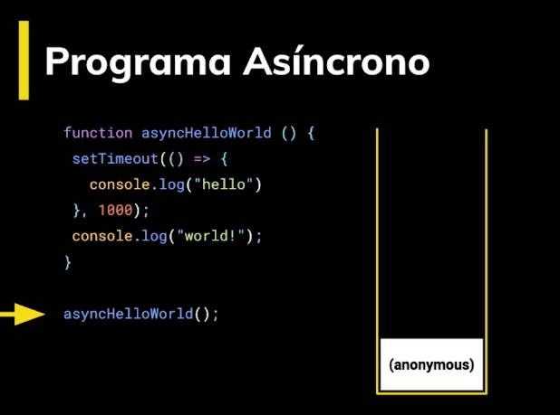

y el stack nuevamente queda vacio, pero sabe que tiene un proceso pendiente y es cuando vuelve a la funcion porque el proceso es asincrono

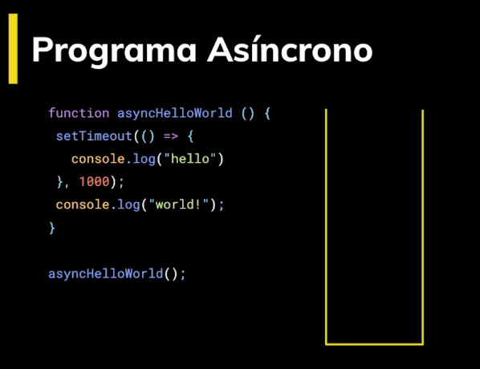

y regresa nuevamente para ejecutar la funcion que estaba pendiente y que se iba a ejecutar eventualmente como se definio en la funcion y entra al console.log imprime hello

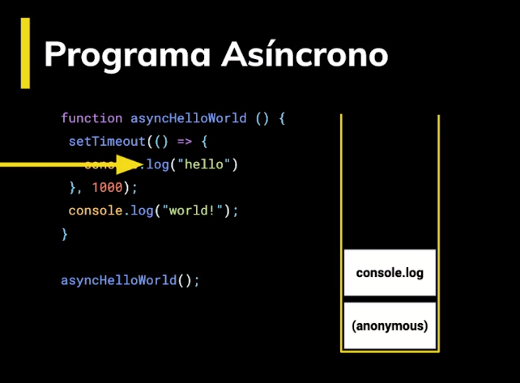

y nuevamente el stack queda vacio y ahora si se acaba el programa


- **Memory Heap**. De forma desorganizada se guarda información de las variables y del scope, este es completamente aleatorio.

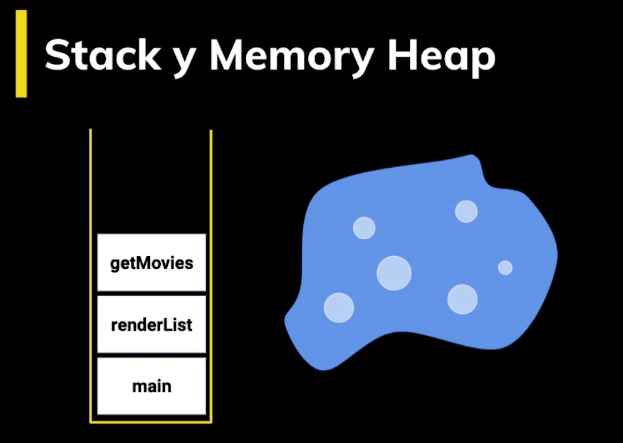

- **Schedule Tasks**. Aquí se agregan a la cola, las tareas programadas para su ejecución.

- **Task Queue**. Aquí se agregan las tareas que ya están listas para pasar al stack y ser ejecutadas. El stack debe estar vacío para que esto suceda.

- **MicroTask Queue**. Aquí se agregan las promesas. Esta Queue es la que tiene mayor prioridad.

El Event Loop es un loop que está ejecutando todo el tiempo y pasa periódicamente revisando las queues y el stack moviendo tareas entre estas dos estructuras.

## Promesas

Para crear las promesas usamos la clase Promise. El constructor de Promise recibe un sólo argumento, un callback con dos parámetros, **resolve** y **reject**. resolve es la función a ejecutar cuando se resuelve y reject cuando se rechaza.

El async/await es sólo syntax sugar de una promesa, por debajo es exactamente lo mismo.

La clase Promise tiene algunos métodos estáticos bastante útiles:

- **Promise.all.** Da error si una de las promesas es rechazada.

- **Promise.race.** Regresa sólo la promesa que se resuelva primero.

Este capitulo se va a realizar con una API que es [themovieDB](https://developers.themoviedb.org/3/getting-started/authentication), en esta se puede crear una cuenta, ir al perfil y solicitar un API key la cual va a hacer falta para poder solicitar los datos a la pagina.

De momento se va a usar el API key que se va a utilizar en el siguiente archivo a crear el cual se va a llamar **promises.html** y va a estar dentro de la carpeta de **ejercicios** con los siguientes bloques de codigo

```
<!DOCTYPE html>
<html lang="en">

<head>
  <meta charset="UTF-8">
  <meta name="viewport"content="width=device-width, initial-scale=1.0">
  <meta http-equiv="X-UA-Compatible"content="ie=edge">
  <title>Promises</title>
</head>

<body>

  <ul>
    <li><button id="sequence">Get Top Movies in Sequence</button></li>
    <li><button id="parallel">Get Top Movies in Parallel</button></li>
    <li><button id="fastest">Get Fastest Top Movie</button></li>
  </ul>

  <ul id="movies"></ul>

  <script>
    const apiKey = 'b89fc45c2067cbd33560270639722eae';

    function getMovie(id) {
      const url = `https://api.themoviedb.org/3/movie/${id}?api_key=${apiKey}`;
      return fetch(url).then(reponse => response.json());
    }

    function getPopularMovies() {
      const url = `https://api.themoviedb.org/3/discover/movie?sort_by=popularity.desc&api_key=${apiKey}`;
      return fetch(url)
        .then(reponse => response.json())
        .then(data => data.results);
    }

    function getTopMoviesIds(n = 3) {
      return getPopularMovies().then(popularMovies =>
        popularMovies.slice(0, n).map(movie => movie.id)
      );
    }

    function renderMovies(movies) {
        const movieList = document.getElementById('movies');
        movieList.innerHTML = '';

        movies.forEach(movie => {
          const listItem = document.createElement('li');
          listItem.innerHTML = `
            
            <h5>${movie.title}</h5>
            <p>Released on <em>${movie.release_date}</em></p>
            `;

          movieList.appendChild(listItem);
        });
      }

      //function getTopMoviesInSequence() {
      //  return [];
      //}

      //function getTopMoviesInParallel() {
      //  return [];
      //}

      //function getFastestTopMovie() {
      //  return [];
      //}

      //document.getElementById('sequence').onclick = async function() {
      //  const movies = await getTopMoviesInSequence();
      //  renderMovies(movies);
      //};

      //document.getElementById('parallel').onclick = async function() {
      //  const movies = await getTopMoviesInParallel();
      //  renderMovies(movies);
      //};

      //document.getElementById('fastest').onclick = async function() {
      //  const movie = await getFastestTopMovie();
      //  renderMovies([movie]);
      //};

  </script>
</body>

</html>

```

en el **index.html** de la carpeta de **ejercicios** agregar la siguiente linea de codigo debajo de prototypal-inheritance

`<li><a href="/ejercicios/promises.html">promises</a></li>`

Luego dirigirse a la siguiente direccion en el navegador y abrir promises http://127.0.0.1:8080/ejercicios/

El archivo **promises.html** ya tiene funciones definidas con la API pero se va a trabajar para convertirlas en Async Await

en el archivo se encuentra la funcion `getTopMoviesIds` la cual va a regresar una promesa con los ids de las peliculas mas populares, donde se solicita n peliculas donde n por omision es igual a 3 y a conitnuacion este es el primer reemplazo que se debe hacer para que then pueda ser reemplazado por await la funcion debe estar con Async de la siguiente forma.

1. Se crea una constante para obtener las peliculas populares

2. Por medio del keyword `await` se manda a llamar a la funcion `getPopularMovies`

3. Se crea la constante `ids` para obtener el id de cada pelicula que se va a obtener

4. De popularMovies solo interesa obtener los primeros n resultados entonces a traves de `slice` se obtiene de 0 a n

5. Por cada una de las peliculas que quede lo que interesa es el id, se usa `map` para transformar un arreglo de objetos a un arreglo de ids 

6. De cada movie se obtiene cada `movide.id`

7. se debe hacer return de los ids

```
     async function getTopMoviesIds(n = 3) {
      //return getPopularMovies().then(popularMovies =>
      //  popularMovies.slice(0, n).map(movie => movie.id)
      //);
      // try {
      //   const popularMovies = await getPopularMovies();
      // }catch(error){
      //     console.log(error.message)
      // }
      const popularMovies = await getPopularMovies();
      const ids = popularMovies.slice(0,n).map(movie => movie.id);
      return ids;
    }
```

la funcion `getPopularMovies` tambien se debe pasar a async await

1. Se pasa la funcion a async

2. Se crea una constante `url` para obtener las peliculas populares

3. Se crea una constante de respuesta y hace la peticion de la url

4. se crea una constante data y la respuesta se pasa a `json`

5. retorna los resultados convertidos en `json`

```
    async function getPopularMovies() {
      const url = `https://api.themoviedb.org/3/discover/movie?sort_by=popularity.desc&api_key=${apiKey}`;
      const response = await fetch(url)
      const data = await response.json()
      return data.results;
    }
```

Ahora se pasa a probar en el navegador en la consola escribiendo getTopMoviesIds se pasa por parametro 2, y como es una promesa se usa `.then` y se imprimen los ids a traves de un `console.log`

`getTopMoviesIds(2).then(ids => console.log(ids))`

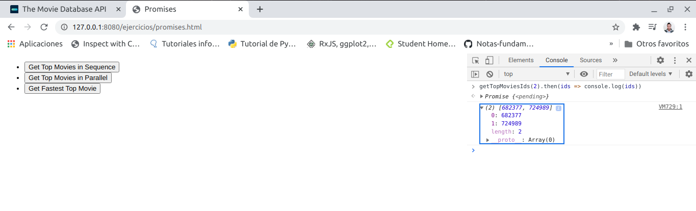

falta por pasar la funcion `getMovie` a async await

1. Se pasa la funcion a async

2. Se crea la constante url para obtener los datos

3. Se crea la constante response para hacer la peticion a la url

4. Se crea la constante data y se convierte a formato `json`

5. Se retornan los datos

```
    async function getMovie(id) {
      const url = `https://api.themoviedb.org/3/movie/${id}?api_key=${apiKey}`;
      const response = await fetch(url)
      const data = await response.json()
      return data;
    }
```

Despues de que las 3 funciones ya esten usando Async await ahora se va a ejecutar cada una de las funciones en secuencia, en paralelo o en una carrera para eso las lineas de abajo se deben quitar los comentarios para empezar a implementar todo el codigo y hacer funcionar los 3 botones que estan en la pagina

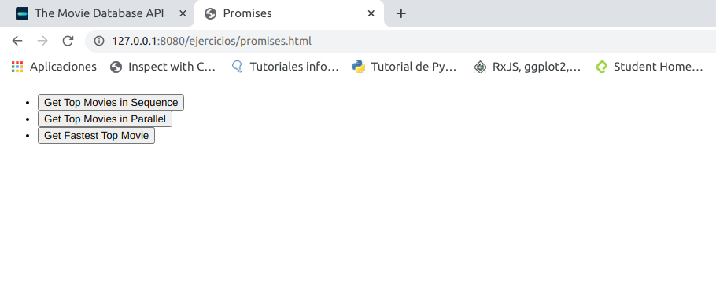

Se empieza con la funcion `getTopMopviesInSequence()`

1. Se pasa la funcion a async

2. Se crea la constante ids para obtener la funcion `getTopMoviesIds()`

3. Se crea una constante movies que recibe un arreglo

4. Se crea un loop que itera sobre cada id

5. Con la constante movie se obtiene getMovie() y se pasa como parametro el id

6. Cada vez que se hace la consulta hace push de movie para ir agregando cada pelicula

7. Por ultimo se retorna el arreglo con el resultado

```
      async function getTopMoviesInSequence() {
        const ids = await getTopMoviesIds()
        const movies = []

        for (const id of ids){
            const movie = await getMovie(id)
            movies.push(movie)
        }
        return movies;
      }
```

y mas abajo en el codigo se obtiene el id del boton del html, con la funcion onclick, se implementa la funcion para obtener getTopMoviesInSequence y por ultimo se hace render de cada movie que se consulte

```
      document.getElementById('sequence').onclick = async function() {
        const movies = await getTopMoviesInSequence();
        renderMovies(movies);
      };
```

Por ultimo en el navegador hacer click sobre el boton Get Top Movies in Sequence para obtener las 3 peliculas mas populares de la semana

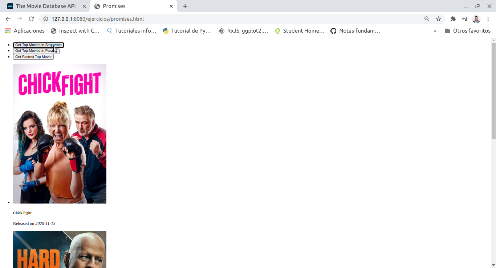

Ahora se implementa la funcion `getTopMoviesInParallel()`

1. Se crea la constante ids para obtener los datos de la funcion `getTopMoviesIds()`

2. Se crea la constante moviePromises para convertir los ids en promesas y por cada uno de los id lo convierte a getMovie(id), como `getMovie` es una funcion async, todas estas regresan promesas

3. Se crea la constante movies y lo que va a hacer es esperar todas las promesas pero lo que va a guardar la constante movies son objetos que guardan las peliculas, en caso de que una de las promesas arroje un error, todo va a arrojar un error

4. por ultimo se retorna movies

```
      async function getTopMoviesInParallel() {
        const ids = await getTopMoviesIds()
        const moviePromises = ids.map(id => getMovie(id))

        const movies = await Promise.all(moviePromises)
        return movies;
      }
```

y mas abajo en el codigo se obtiene el id del boton del html, con la funcion onclick, se implementa la funcion para obtener getTopMoviesInparallel y por ultimo se hace render de cada movie que se consulte

```
      document.getElementById('parallel').onclick = async function() {
        const movies = await getTopMoviesInParallel();
        renderMovies(movies);
      };
```

Por ultimo en el navegador hacer click sobre el boton Get Top Movies in Parallel para volver a obtener las 3 peliculas


y por ultimo obtener cual es la peticion que llega primero a traves de la funcion `getFastestTopMovie()`

1. Se crea la constante ids para obtener los datos de la funcion `getTopMoviesIds()`

2. Se crea la constante moviePromises para convertir los ids en promesas y por cada uno de los id lo convierte a getMovie(id), como `getMovie` es una funcion async, todas estas regresan promesas

3. A traves de la constante movie con el metodo Promise.race() se obtiene la primer peticion que llegue

4. Se retorna movie

```
      async function getFastestTopMovie() {
        const ids = await getTopMoviesIds()
        const moviePromises = ids.map(id => getMovie(id))
        
        const movie = await Promise.race(moviePromises)
        return movie;
      }
```

y mas abajo en el codigo se obtiene el id del boton del html, con la funcion onclick, se implementa la funcion para obtener getFastestTopMovie y por ultimo se hace render de cada movie que se consulte

```
      document.getElementById('fastest').onclick = async function() {
        const movie = await getFastestTopMovie();
        renderMovies([movie]);
      };
```

Por ultimo en el navegador hacer click sobre el boton Get Fastest Top Movie para obtener una pelicula que en este caso es la primera que llego a la peticion

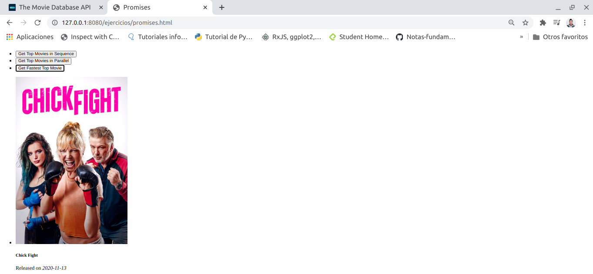

Pero no siempre se obtiene la misma peticion, puede llegar a obtener otra peticion de una de las peliculas, depende de la red, de la API o otra serie de sucesos

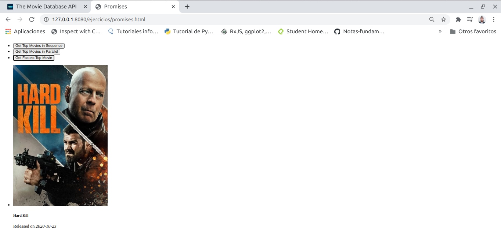

## Getters y setters

Los getters y setters son funciones que podemos usar en un objeto para tener propiedades virtuales. Se usan los keywords set y get para crear estas propiedades.

Estas propiedades al ser funciones pueden llevar una validación de por medio y ser usadas con el operador de asignación como si fueran una variable más dentro del objeto.

Para ver el ejemplo abrir el archivo **MediaPlayer.js** que se encuentra en la carpeta **assets** del proyecto y se va a modificar un poco para establecer los **getters** y **setters** en la funcion `initPlugins`

1. Se crea una constante player que recibe un arreglo

2. Se crean cada una de las llaves para acceder a `this.play()`, `this.pause()`, `this.media`

3. Se establece get para obtener el metodo muted

4. Se establece set para establecer un valor falso o verdadero


```
    initPlugins(){
      const player = {
        play: () => this.play(),
        pause: () => this.pause(),
        media: this.media,
        get muted() {
          return this.media.muted;
        },

        set muted(value) {
          this.media.muted = value;
        }
      };

      this.plugins.forEach(plugin => {
        plugin.run(player);
      });
    };
```

A continuacion abrir la carpeta **plugins** y abrir el archivo **AutoPlay.js** y modificar por el siguiente bloque de codigo

1. Al ejecutar a player se agrega una validacion

2. Si al hacer AutoPlay no esta muteado entonces la variable dejarla en verdadero para que este muteado

3. ejecutar el metodo `player.play()`

```
class AutoPlay {
    run(player){
        if(!player.muted){
            player.muted = true;
        }
        player.play()
    }
}

export default AutoPlay;
```

Por ultimo en el archivo **index.js** del proyecto, descomentar el plugin Autoplay para probar en el navegador

## Proxy

El proxy sirve para interceptar la lectura de propiedades de un objeto (los get, y set) entre muchas otras funciones. Así, antes de que la llamada llegue al objeto podemos manipularla con una lógica que nosotros definamos. para ver mas informacion consultar en [Handler Functions](https://developer.mozilla.org/en-US/docs/Web/JavaScript/Reference/Global_Objects/Proxy/Proxy)

Lo que hace el proxy es ayudar a encontrar un valor por ejemplo cuando se usa git en la consola 

por ejemplo al escribir mal `git add .`

la consola muestra una sugerencia de lo que se deberia usar o inidica que se consulte en las ayudas del programa

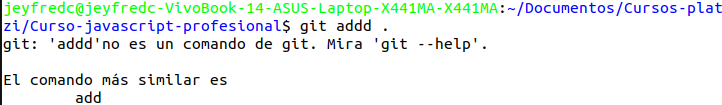

o por ejemplo el comando `npm help` mal escrito

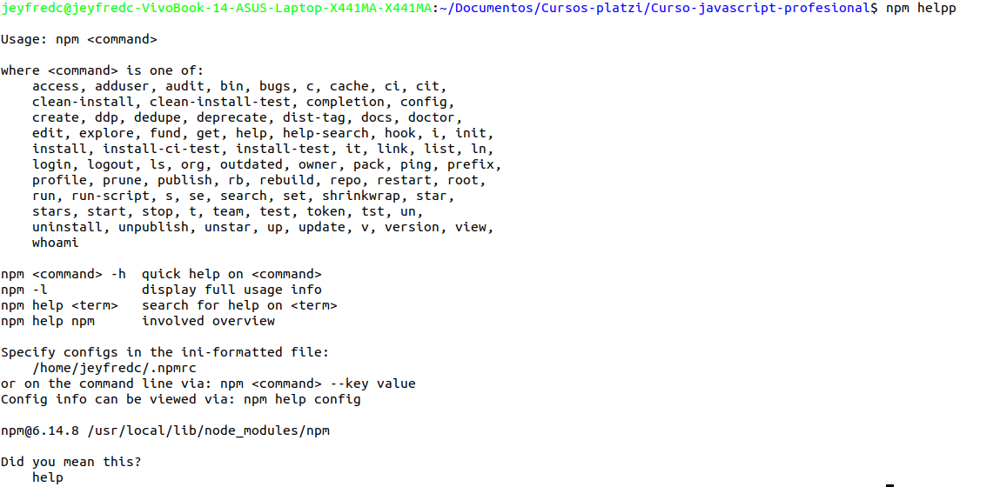

Al final sale una sugerencia del comando que se deberia usar

Para explicar mejor esto en la carpeta de **ejercicios** crear el archivo **proxy.html** y agregar lo siguiente

```
<html>
  <head>
    <title>Proxy</title>
  </head>

  <body>
    <a href="/ejercicios/">Go back</a>
    <p><em>Abre la consola</em></p>

    <script src="https://unpkg.com/fast-levenshtein@2.0.6/levenshtein.js"></script>
    <script>
      // Proxy es parecido a getters y setters
      // Usa un concepto que se llama traps: son interceptores de llamadas. A diferencia de getters, no opera sobre una propieda, si no sobre un objeto.
      // https://developer.mozilla.org/en-US/docs/Web/JavaScript/Reference/Global_Objects/Proxy#Methods_of_the_handler_object

      // Creemos un ejemplo donde interceptamos llamadas para leer una propiedad
      // Si la propiedad existe, la regresamos
      // Si no existe, entonces sugerimos una que pueda funcionar

      // Para eso eso vamos a usar un algoritmo que se llama Levenshtein. (window.Levenshtein.get)
      // Ejemplos de levenshtein distance (usa window.Levenshtein)

    </script>
  </body>
</html>
```

en **index.html** de ejercicios agregar la siguiente linea de codigo debajo de `promises`

`<li><a href="/ejercicios/proxy.html">proxy</a></li>`

Dirigir el navegador a la siguiente ruta http://127.0.0.1:8080/ejercicios/ y seleccionar proxy, luego abrir la consola del navegador para hacer una prueba

para ejecutar dicha prueba se va a ejecutar la libreria que se llama **fast-levenshtein** que esta cargado en el documento **proxy.html** a traves de la etiqueta script `<script src="https://unpkg.com/fast-levenshtein@2.0.6/levenshtein.js"></script>`

**fast-levenshtein** es un algoritmo que va a encontrar la distancia que hay entre 2 cadenas de caracter.

Notar en el ejemplo a continuacion 

JavaScript y Java son palabras distintas para que Java sea igual a JavaScript hacen falta 6 caracter

al igual que en el otro ejemplo Script y Scripd son diferentes para que sean iguales su distancia es de 1 caracter

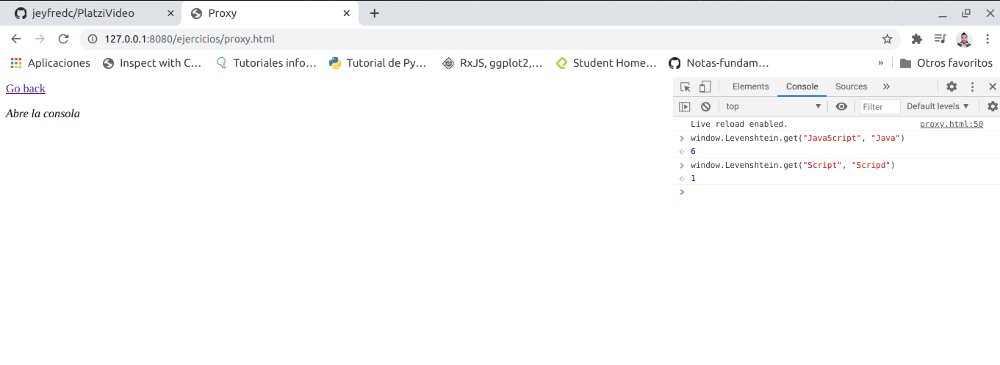

A conitnuacion abrir el archivo **proxy.html** para empezar a implementar el siguiente bloque de codigo

1. Se crea una constante p que va a regresar al objeto Proxy, como Proxy es una clase se debe instanciar con la palabra reservada `new`, esta clase va a obtener 2 argunmentos que es el target y el handler

2. El target es el objeto que se quiere interceptar, es decir antes de que una llamada llegue a este objeto se debe interceptar. Se crea el objeto target el cual va a recibir un arreglo de colores, red, green y blue

3. Si llega a haber una equivocacion lo que se quiere es que al buscar esas propiedades del objeto target existan ayudas y se crea el objeto handler el cual tiene acceso a diferentes metodos con las [Handler Functions](https://developer.mozilla.org/en-US/docs/Web/JavaScript/Reference/Global_Objects/Proxy/Proxy) y en este caso se usa `handler.get()` y get va a recibir 2 parametros, el `obj` objeto el cual representa `target` y la `prop` que es la propiedad que se esta tratando de leer

4. Si la propiedad existe dentro del objeto no se debe hacer nada para eso se realiza una validacion indicando que si la propiedad esta en el objeto se retorna el valor buscado

5. Hay que buscar una sugerencia, se crea otro objeto llamado `suggestion` y se debe indicar cual es la llave del array de target que mas se parece y que el usuario esta buscando para eso se listan todas las llaves usando `Object.keys` del objeto el cual se pasa como parametro y a traves de find encontrar una de las llaves

6. Se retorna el resultado usando `Levenshtein.get` que busca en la llave y la propiedad que sean menores o iguales a 3

7. En caso de no encontrar se hace otra validacion indicando que la propiedad que esta buscando no se encuentra, y luego quisiste decir la sugerencia

8. Por ultimo hay que regresar el objeto a traves de `obj[prop]`

```
<html>
  <head>
    <title>Proxy</title>
  </head>

  <body>
    <a href="/ejercicios/">Go back</a>
    <p><em>Abre la consola</em></p>

    <script src="https://unpkg.com/fast-levenshtein@2.0.6/levenshtein.js"></script>
    <script>
      // Proxy es parecido a getters y setters
      // Usa un concepto que se llama traps: son interceptores de llamadas. A diferencia de getters, no opera sobre una propieda, si no sobre un objeto.
      // https://developer.mozilla.org/en-US/docs/Web/JavaScript/Reference/Global_Objects/Proxy#Methods_of_the_handler_object

      // Creemos un ejemplo donde interceptamos llamadas para leer una propiedad
      // Si la propiedad existe, la regresamos
      // Si no existe, entonces sugerimos una que pueda funcionar

      // Para eso eso vamos a usar un algoritmo que se llama Levenshtein. (window.Levenshtein.get)
      // Ejemplos de levenshtein distance (usa window.Levenshtein)

      const target = {
          red: 'Rojo',
          green: 'Verde',
          blue: 'Azul',
      }

      const handler = {
          get(obj, prop){
              if (prop in obj){
                  return obj[prop];
              }

              const suggestion = Object.keys(obj).find(key =>{
                return Levenshtein.get(key, prop) <= 3;
              });

              if (suggestion){
                console.log(`${prop} no se encontró. Quisiste decir ${suggestion}?`);
              }

              return obj[prop];
          }
      }

      const p = new Proxy(target, handler);

    </script>
  </body>
</html>

```

Despues de esto nuevamente pasar a la consola y empezar a hacer las busquedas

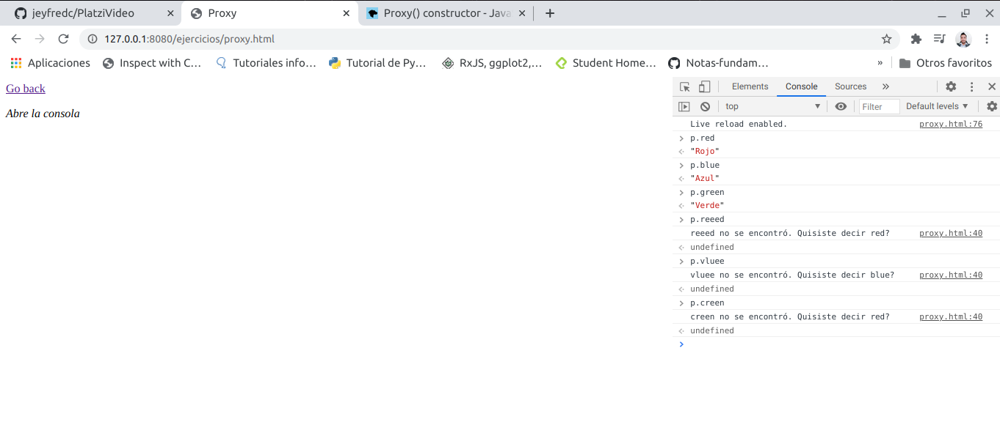